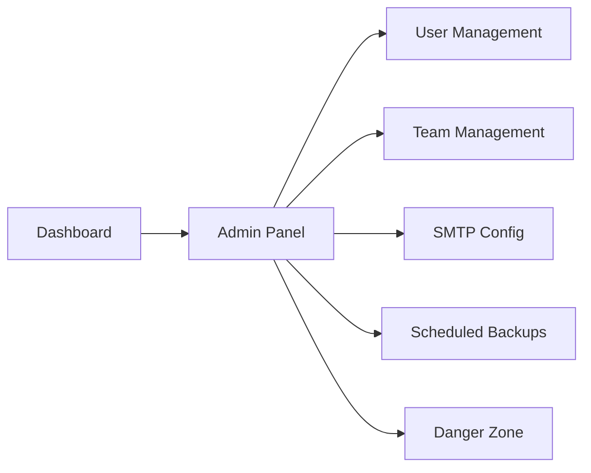
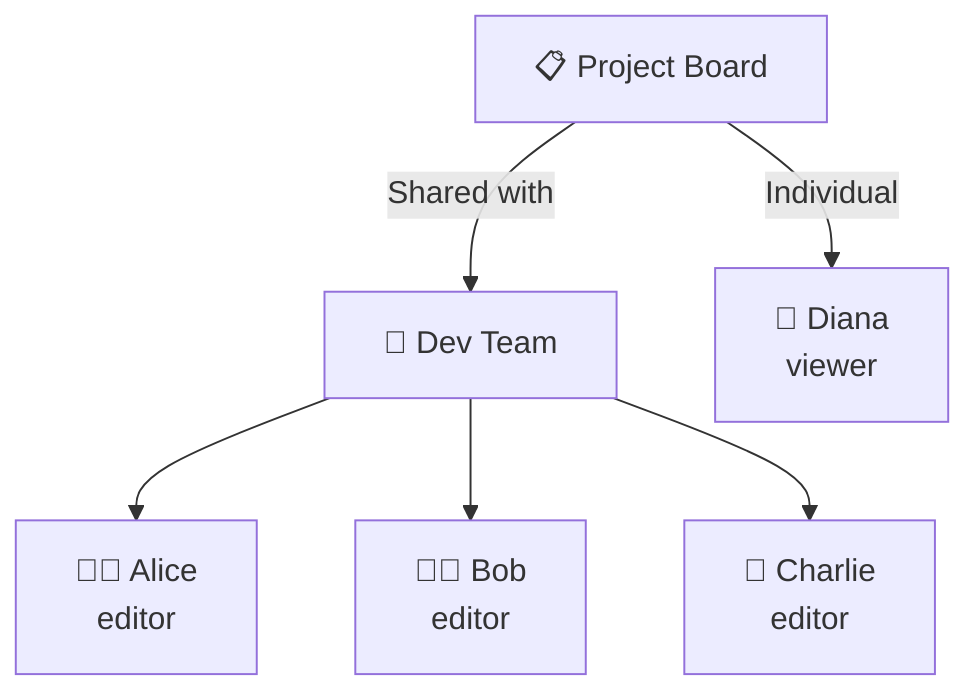
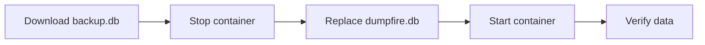

# Admin Operations Guide

This guide covers day-to-day administration tasks for DumpFire. You need the **Admin** or **Superadmin** role to access the Admin panel.

## Accessing the Admin Panel

Click the **⚙️ Admin** link in the dashboard sidebar or navigate to `/admin`.



---

## User Management

### Creating Users

1. Go to **Admin → Users**
2. Enter username, email, and role
3. Click **Create User**
4. An invite email is sent automatically (if SMTP is configured)
5. The user clicks the link to set their password

### User Roles

| Role | Admin Panel | Manage Users | All Boards | Board Sharing |
|------|------------|-------------|------------|---------------|
| **Superadmin** | ✅ | ✅ | ✅ Implicit | ✅ |
| **Admin** | ✅ | ✅ | ✅ Implicit | ✅ |
| **User** | ❌ | ❌ | Only shared | Only if owner |

### Modifying Users

- **Change role** — promote or demote between user/admin/superadmin
- **Reset password** — generate a new invite link for password reset
- **Delete user** — permanently remove (cascades to sessions, assignments)

---

## Team Management

### Creating Teams

1. Go to the **Teams** page from the dashboard
2. Click **Create Team**
3. Name the team and choose an emoji
4. Add members — each with **Owner** or **Member** role

### Sharing Boards with Teams

When you share a board with a team, all team members inherit the team's board role (editor or viewer). New members added to the team automatically gain access.



---

## SMTP Configuration

Email is required for notifications, invites, and report delivery.

### Setup Steps

1. Go to **Admin → Email Settings**
2. Fill in your SMTP details:

| Field | Example | Notes |
|-------|---------|-------|
| **Host** | `smtp.gmail.com` | Your SMTP server |
| **Port** | `587` | 587 for STARTTLS, 465 for SSL |
| **Username** | `noreply@company.com` | Auth username |
| **Password** | `app_password` | Use app passwords for Gmail |
| **From Address** | `noreply@company.com` | Sender email |
| **From Name** | `DumpFire` | Display name in inbox |

3. Click **Send Test Email** to verify
4. Save the configuration

### Troubleshooting

| Problem | Solution |
|---------|----------|
| Connection timeout | Check firewall rules for outbound SMTP port |
| Auth failure with Gmail | Use an App Password, not your Google password |
| Emails going to spam | Set up SPF/DKIM records for your sending domain |
| IPv6 timeout | DumpFire forces IPv4 — this is handled automatically |

---

## Backup Management

### Configuring Backups

1. Go to **Admin → Scheduled Backups**
2. Choose a schedule: Hourly, Every 6h, 12h, Daily, or Weekly
3. For daily/weekly: set the time and day
4. Add destinations (SFTP / S3 / Google Drive / OneDrive)
5. Set retention count (how many backups to keep)
6. Enable failure email alerts

### Manual Backup

Click **Run Backup Now** in the admin panel to trigger an immediate backup to all configured destinations.

### Backup History

The last 10 backup attempts are shown with:
- Destination name and type
- File size
- Duration
- Status (success or failed with error message)

### Restoring from Backup

1. Download the `.db` file from your backup destination
2. Stop the DumpFire container
3. Replace `/app/data/dumpfire.db` with the backup file
4. Restart the container



---

## Archive Management

### Archived Cards Page

Access from the dashboard **More ⋯** menu → **Archived**.

Features:
- **Search** — find archived cards by title
- **Filter by board** — narrow down to a specific board
- **Restore** — move card back to its original column
- **Permanent delete** — remove card and all related data forever

### Admin Purge

**Danger Zone** in the Admin panel includes a **Purge All Archived Cards** button that permanently deletes every archived card across all boards.

> ⚠️ This action is irreversible. A confirmation dialog prevents accidental clicks.

---

## Board Categories

Organise boards into categories for the dashboard sidebar:

1. Go to **Admin → Board Categories** (or use the dashboard category manager)
2. Create categories with names and colours
3. Assign boards to categories

Categories appear as collapsible groups in the dashboard sidebar.

---

## Notification Preferences

Each user controls their own notification preferences from **My Account**:

| Toggle | Controls |
|--------|----------|
| **All emails** | Master switch for all notifications |
| **Assignment** | Notified when assigned to a card |
| **Card moved** | Notified when your card changes column |
| **Comments** | Notified when someone comments on a board card |
| **Mentions** | Notified when @mentioned in a comment |
| **Board shared** | Notified when a board is shared with you |
| **Requests** | Notified of new task requests |
| **Request progress** | Requesters receive progress updates |

---

## System Health Monitoring

### Logs

DumpFire logs to stdout with prefixed module names:

```
[HTTP]  GET /board/1 → 200
[NOTIFY] Card-created notification sent to alice@example.com
[BACKUP] Backup succeeded: sftp-server → dumpfire-backup-2026-04-14.db (1.2s, 210 KB)
[REPORTS] Generated weekly report for "Sprint Board" (3 recipients)
```

### Database Location

| Environment | Path |
|-------------|------|
| Development | `./dumpfire.db` in project root |
| Docker | `/app/data/dumpfire.db` |

### Activity Log

Every board change is recorded in the activity log (visible per-board in the stats panel). This includes:
- Card created, updated, moved, deleted
- Comment added
- User assigned / unassigned
- API actions (prefixed with `api:`)
