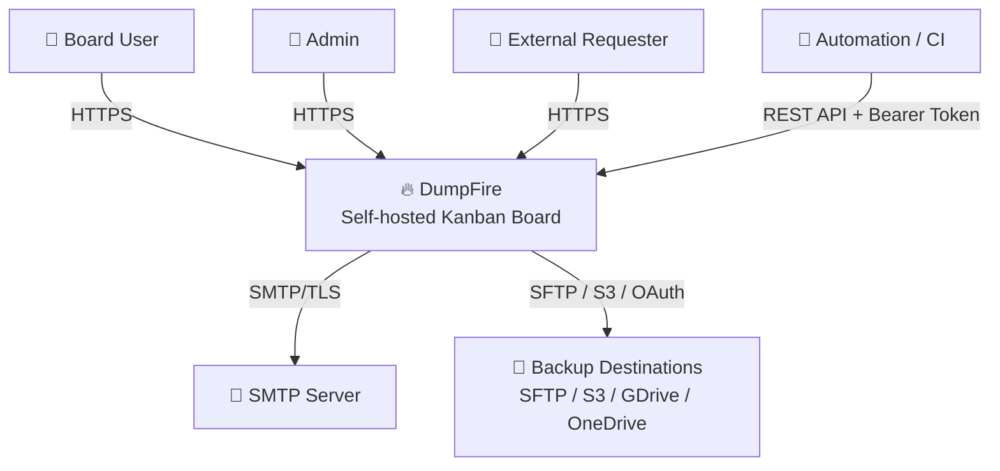
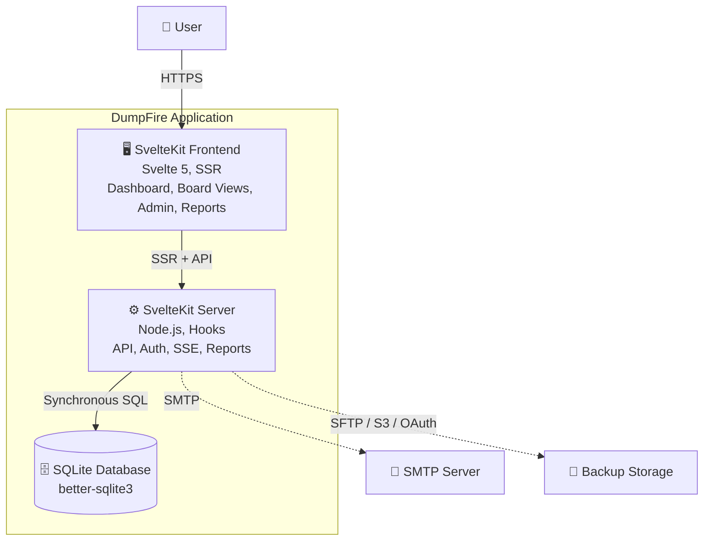
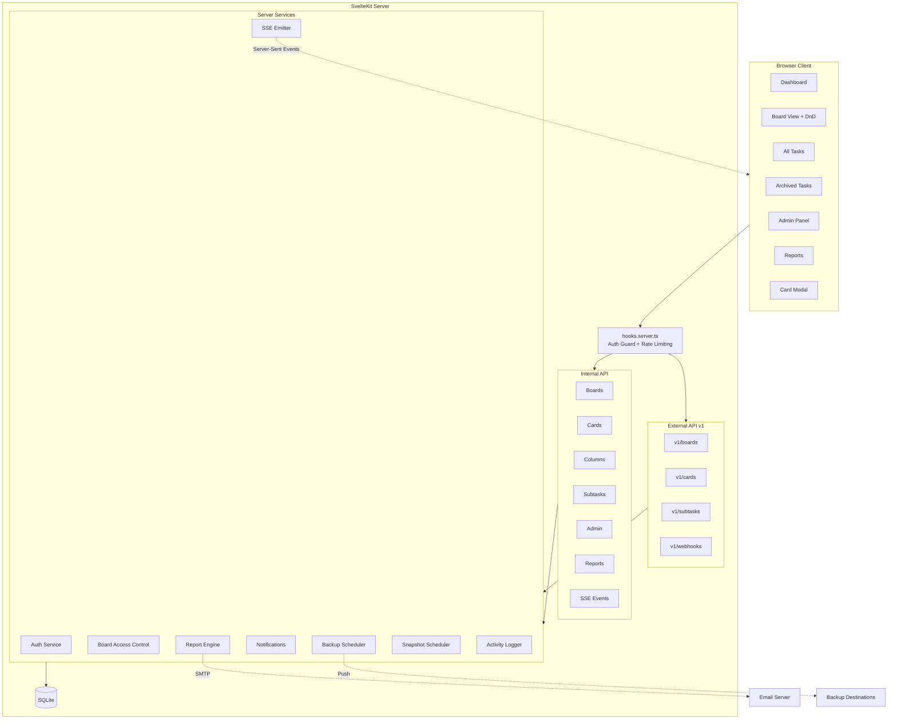
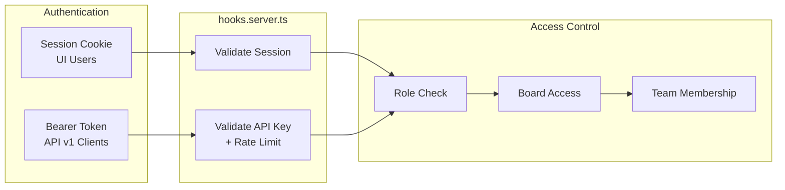
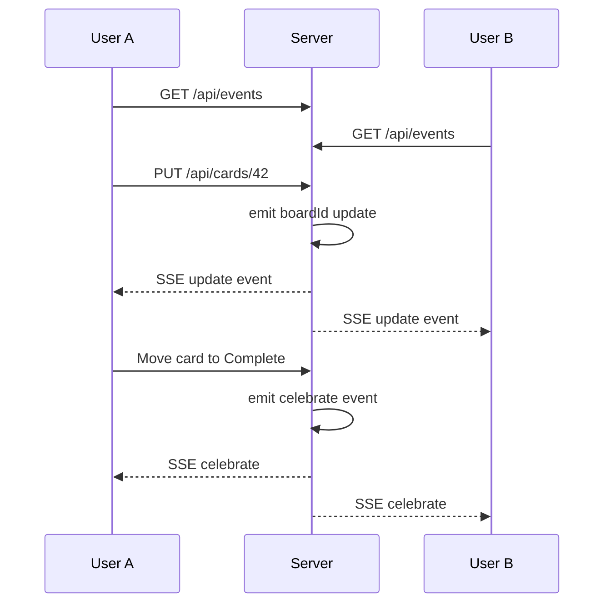
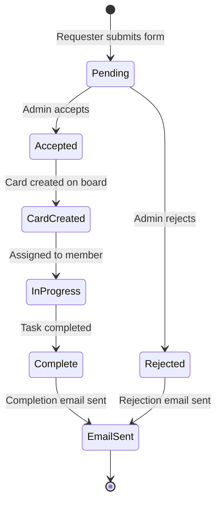

# DumpFire Architecture Overview

DumpFire is a self-hosted, real-time Kanban board application designed for speed and simplicity. It runs as a single-process Node.js application with an embedded SQLite database — no external services required.

## System Context

## Container Diagram

## Technology Stack

| Layer | Technology | Purpose |
|-------|-----------|---------|
| **Framework** | SvelteKit 2 + Svelte 5 | Full-stack SSR framework with file-based routing |
| **Language** | TypeScript 5.9 | Type-safe server and client code |
| **Database** | SQLite via better-sqlite3 | Embedded, zero-config relational database |
| **ORM** | Drizzle ORM 0.45 | Type-safe schema definition and queries |
| **Auth** | Session cookies + bcryptjs | Cookie-based sessions for UI, API keys for external access |
| **Real-time** | Server-Sent Events | Live board updates without WebSocket complexity |
| **PDF Reports** | PDFKit | Server-side PDF generation for scheduled and on-demand reports |
| **Email** | Nodemailer | SMTP integration for notifications and report delivery |
| **Backup** | AWS S3 SDK, ssh2-sftp-client, Google/Microsoft APIs | Multi-destination scheduled backups |
| **Deployment** | Docker node:22-slim | Two-stage build, single container |

## Component Architecture

## Authentication and Authorisation

### Role Hierarchy

| Role | Boards | Admin | Users |
|------|--------|-------|-------|
| `superadmin` | All boards | Full access | Manage all |
| `admin` | All boards | Full access | Manage all |
| `user` | Only shared boards | No access | Self only |

### Board Access Levels

| Level | View | Edit Cards | Manage Board |
|-------|------|-----------|--------------|
| `owner` | ✅ | ✅ | ✅ |
| `editor` | ✅ | ✅ | ❌ |
| `viewer` | ✅ | ❌ | ❌ |

## Real-Time Updates via SSE

## Request Lifecycle

External users can submit task requests without authentication:

## Scheduled Background Tasks

| Scheduler | Interval | Purpose |
|-----------|----------|---------|
| Backup Scheduler | Configurable | Push DB backup to SFTP/S3/GDrive/OneDrive |
| Report Scheduler | Weekly/Monthly | Generate and email PDF reports |
| Snapshot Scheduler | Daily midnight | Card counts per column for CFD/burndown |
| Session Cleanup | On startup | Remove expired session tokens |

## Key Design Decisions

1. **SQLite over Postgres/MySQL** — Zero-config, file-based, perfect for self-hosted single-tenant deployments. Synchronous queries via better-sqlite3 are faster than async alternatives for this workload.

2. **SSE over WebSockets** — Simpler server implementation, automatic reconnection built into the browser API, works through HTTP/2 proxies without special config.

3. **Single-process architecture** — No external message queues, no separate worker processes. All schedulers run in-process with `setInterval`. Suitable for the target scale (team-sized deployments).

4. **Drizzle ORM** — Type-safe schema that serves as the source of truth. Migrations managed via `drizzle-kit` with SQL files checked into `drizzle/`.

5. **Soft-delete (archive)** — Cards are soft-deleted by setting `archivedAt`. Hard delete available via `?permanent=true` query parameter. Admin purge endpoint for bulk cleanup.
