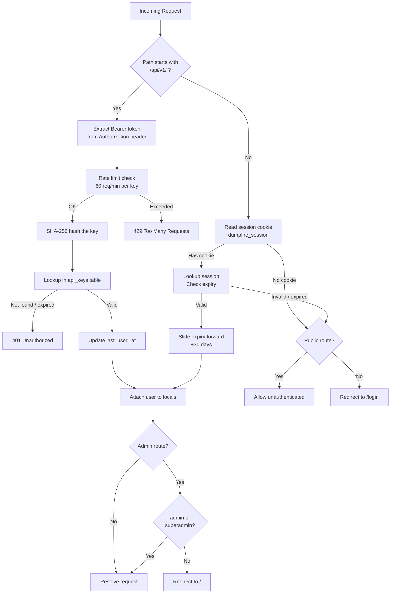
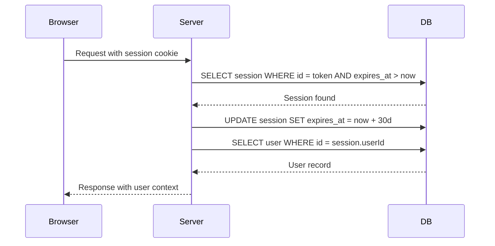
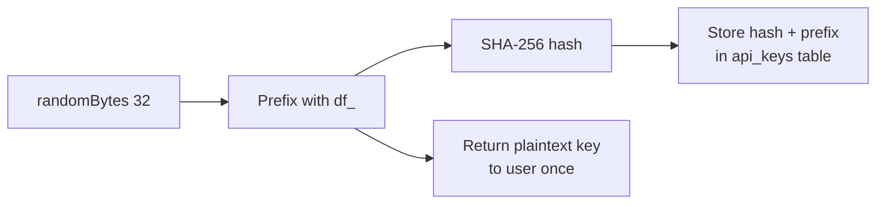
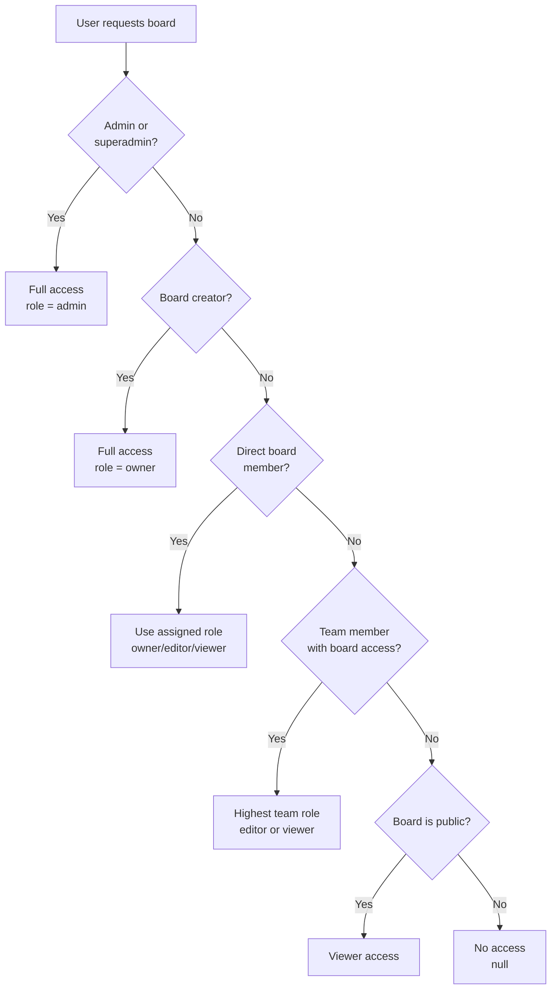
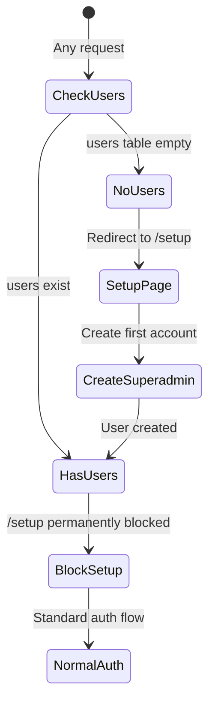

# Authentication & Security

DumpFire uses two authentication methods: session cookies for browser users and bearer tokens for API clients. All auth logic lives in `src/lib/server/auth.ts` with board-level access control in `src/lib/server/board-access.ts`.

## Authentication Flow

## Session Management

| Property | Value |
|----------|-------|
| Cookie name | `dumpfire_session` |
| Token format | `crypto.randomUUID()` |
| Duration | 30 days sliding window |
| Storage | `sessions` table in SQLite |
| Flags | `httpOnly`, `sameSite: lax`, `secure` in production |

### Sliding Window

Every valid session access extends the expiry by 30 days. This means active users never get logged out, while inactive sessions expire naturally.

## Password Hashing

- **Algorithm**: bcrypt via `bcryptjs`
- **Rounds**: 12
- **Functions**: `hashPassword()` and `verifyPassword()` in `auth.ts`

## API Key System

API keys provide stateless authentication for the external API (`/api/v1/*`).

### Key Generation

| Property | Value |
|----------|-------|
| Format | `df_` + 64 hex chars |
| Hash algorithm | SHA-256 |
| Storage | Only the hash is stored |
| Prefix stored | First 11 chars for identification |
| Expiry | Optional per-key |
| Rate limit | 60 requests/minute per key |

### Key Lifecycle

1. User generates key via Admin panel or Account page
2. Plaintext shown **once** — user must copy it
3. Only the SHA-256 hash is stored in `api_keys` table
4. Each use updates `last_used_at` timestamp
5. Expired keys are rejected at validation time

## Board Access Control

Board access is determined by `board-access.ts` using a priority-based resolution.

### Access Resolution Order

### Permission Matrix

| Action | Owner | Editor | Viewer | Admin |
|--------|-------|--------|--------|-------|
| View board | ✅ | ✅ | ✅ | ✅ |
| Create/edit cards | ✅ | ✅ | ❌ | ✅ |
| Move cards | ✅ | ✅ | ❌ | ✅ |
| Manage columns | ✅ | ❌ | ❌ | ✅ |
| Share board | ✅ | ❌ | ❌ | ✅ |
| Delete board | ✅ | ❌ | ❌ | ✅ |

## Security Headers

Applied to all responses in `hooks.server.ts`:

| Header | Value | Purpose |
|--------|-------|---------|
| `X-Content-Type-Options` | `nosniff` | Prevents MIME sniffing |
| `X-Frame-Options` | `DENY` | Blocks iframe embedding |
| `Referrer-Policy` | `strict-origin-when-cross-origin` | Limits referrer leakage |
| `Permissions-Policy` | `camera=(), microphone=(), geolocation=()` | Disables unused browser APIs |
| `X-XSS-Protection` | `1; mode=block` | Legacy XSS protection |

## First-Run Setup Guard

## Key Implementation Files

| File | Purpose |
|------|---------|
| `src/lib/server/auth.ts` | Password hashing, session CRUD, API key generation and validation |
| `src/lib/server/board-access.ts` | Board-level role resolution and permission checks |
| `src/hooks.server.ts` | Request-level auth guard, rate limiting, security headers |
| `src/lib/server/rate-limit.ts` | In-memory sliding window rate limiter |
