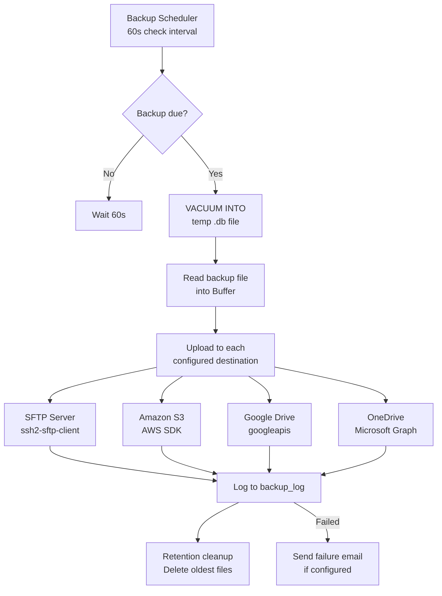
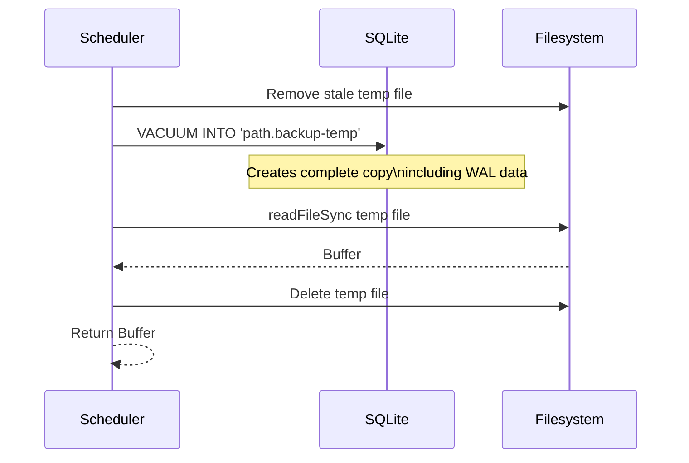
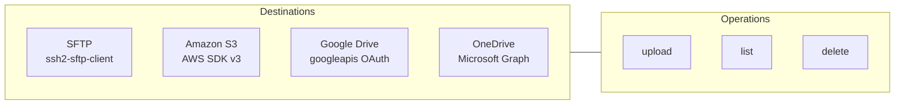
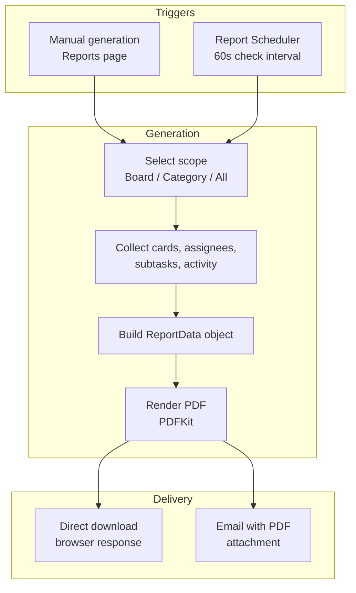
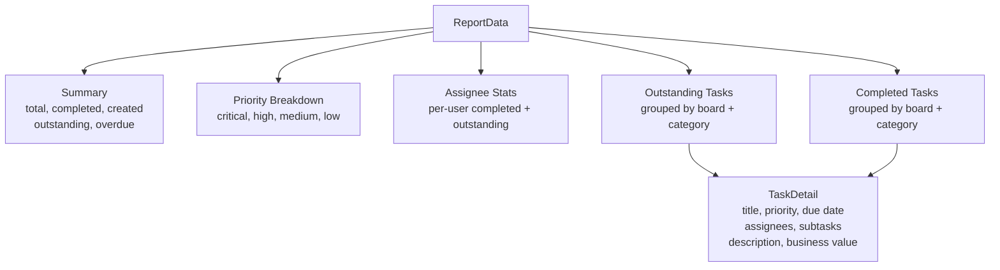
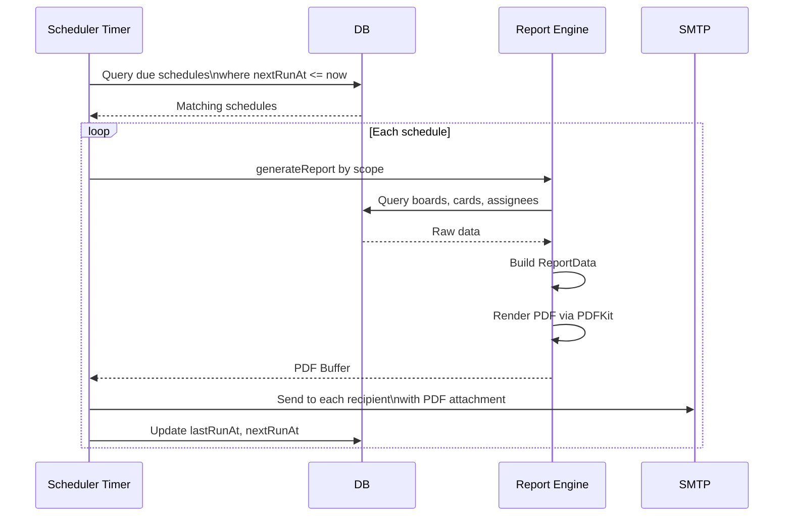

# Backup & Reporting System

DumpFire includes two scheduled systems: automated database backups to multiple cloud/remote destinations, and PDF report generation with email delivery.

## Backup System

### Backup Architecture



### Schedule Options

| Schedule | Mechanism | Description |
|----------|-----------|-------------|
| `disabled` | — | No automatic backups |
| `hourly` | Interval | Every 60 minutes since last backup |
| `every6h` | Interval | Every 6 hours since last backup |
| `every12h` | Interval | Every 12 hours since last backup |
| `daily` | Time-based | Once per day at configured time |
| `weekly` | Time-based | Once per week on configured day and time |

### Backup Configuration

Stored as JSON in the `settings` table under key `backup_config`:

```json
{
  "schedule": "daily",
  "scheduleTime": "02:00",
  "scheduleDay": 0,
  "retention": 7,
  "destinations": [],
  "notifyOnFailure": true,
  "notifyEmail": "admin@example.com"
}
```

### Backup Data Generation

Uses SQLite's `VACUUM INTO` command to create a self-contained snapshot:



This approach ensures the backup includes all WAL data — a raw file copy would miss unflushed writes.

### Destination Types



Each destination implements three operations:
- **upload** — Push a backup buffer with a timestamped filename
- **list** — List existing backups for retention cleanup
- **delete** — Remove old backups beyond retention limit

### Retention Cleanup

After each successful upload, the system:
1. Lists all backup files at the destination
2. Sorts oldest-first
3. Deletes files exceeding the configured retention count

### Failure Notifications

If `notifyOnFailure` is enabled and SMTP is configured, a styled HTML email is sent to the configured address with the error details.

---

## Report System

### Report Architecture



### Report Scopes

| Scope | Description | Data Included |
|-------|-------------|---------------|
| `board` | Single board | All cards in that board for the period |
| `category` | Board category | All boards in a category, aggregated |
| `all` | All boards | Every board across the system |

### Report Data Structure



### PDF Generation

PDFs are rendered server-side using PDFKit with a professional layout:

- **Header** — DumpFire branding, report title, date range
- **Executive Summary** — Key metrics in stat cards
- **Priority Breakdown** — Visual bar chart
- **Assignee Performance** — Table of completions per user
- **Outstanding Tasks** — Grouped by board with full detail
- **Completed Tasks** — Recent completions with timestamps

### Report Scheduling

Configured per-user via the Reports page:

| Field | Type | Description |
|-------|------|-------------|
| `scope` | board/category/all | What to report on |
| `scopeId` | number | Board or category ID |
| `frequency` | weekly/monthly | How often |
| `dayOfWeek` | 0-6 | Day for weekly reports |
| `dayOfMonth` | 1-31 | Day for monthly reports |
| `timeOfDay` | HH:MM | When to generate |
| `recipients` | comma-separated emails | Where to send |
| `periodDays` | number | Lookback period in days |
| `enabled` | boolean | Active toggle |

### Schedule Execution



### Card Reports

Individual card reports can be generated for completion notifications. These include:
- Card title, priority, and business value
- Description rendered as text
- Subtask completion status
- Assignee list
- Activity timeline

## Key Implementation Files

| File | Lines | Purpose |
|------|-------|---------|
| `src/lib/server/backup.ts` | 374 | Backup scheduling, data generation, upload orchestration |
| `src/lib/server/backup-destinations.ts` | ~400 | SFTP, S3, Google Drive, OneDrive destination implementations |
| `src/lib/server/reports.ts` | 1124 | Report data collection, PDF rendering, schedule management |
| `src/lib/server/snapshots.ts` | ~80 | Daily card count snapshots for CFD/burndown charts |
