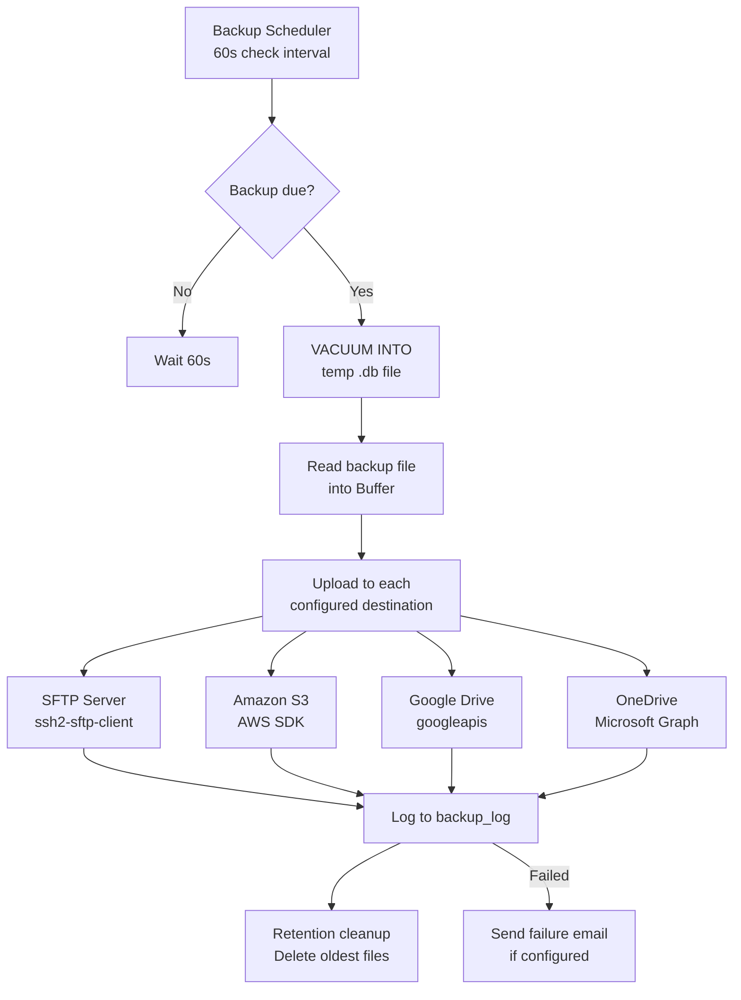
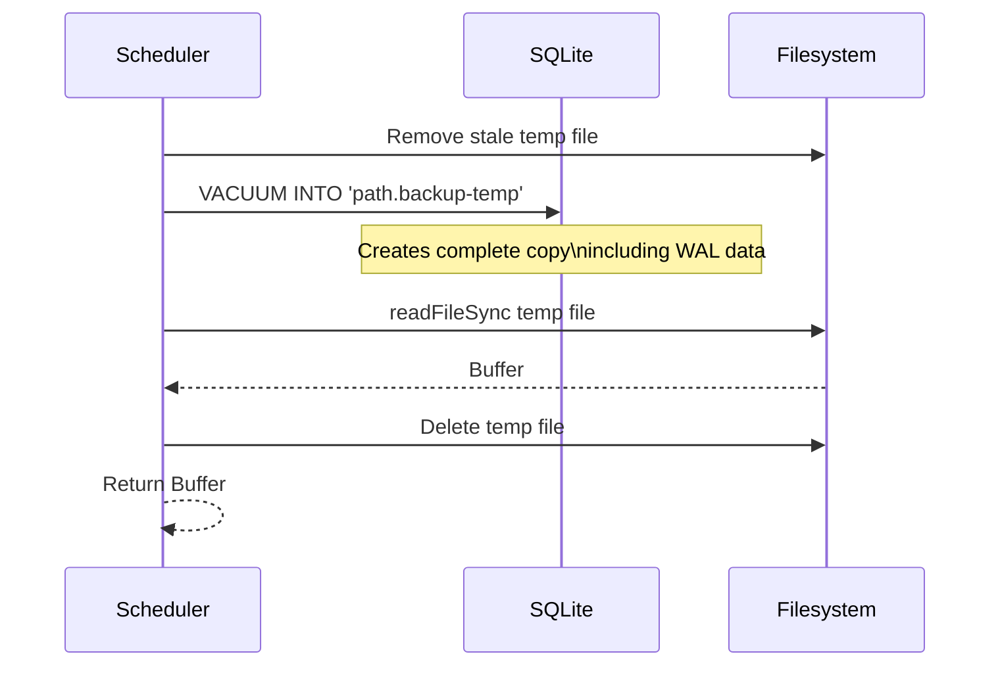
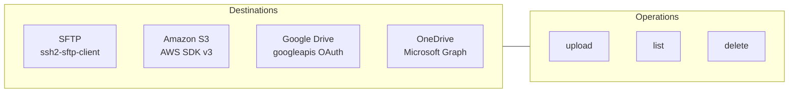
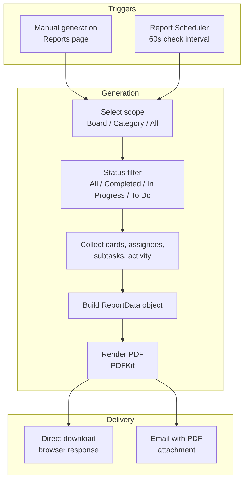
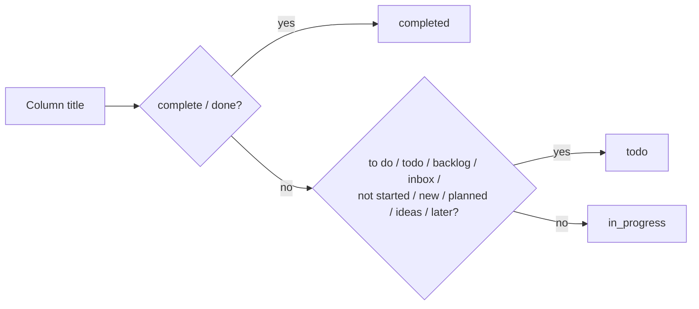
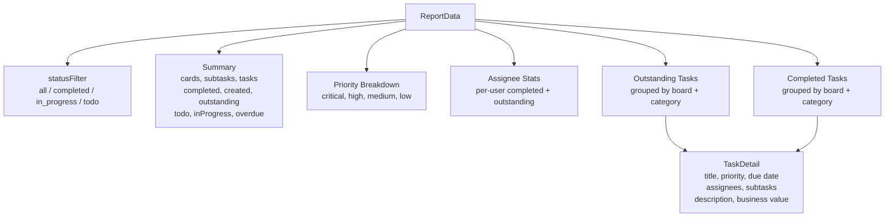
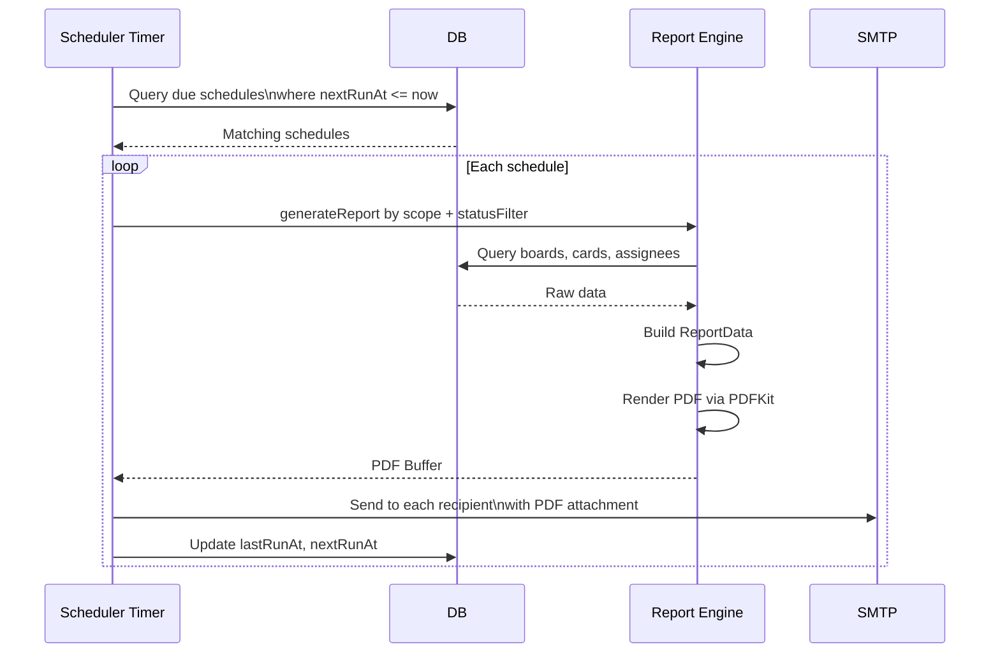

# Backup & Reporting System

DumpFire includes two scheduled systems: automated database backups to multiple cloud/remote destinations, and PDF report generation with email delivery.

## Backup System

### Backup Architecture


```mermaid
flowchart TD
    Scheduler["Backup Scheduler\n60s check interval"]
    Scheduler --> DueCheck{"Backup due?"}
    DueCheck -->|"No"| Wait["Wait 60s"]
    DueCheck -->|"Yes"| Generate["VACUUM INTO\ntemp .db file"]
    Generate --> ReadFile["Read backup file\ninto Buffer"]
    ReadFile --> Upload["Upload to each\nconfigured destination"]

    Upload --> SFTP["SFTP Server\nssh2-sftp-client"]
    Upload --> S3["Amazon S3\nAWS SDK"]
    Upload --> GDrive["Google Drive\ngoogleapis"]
    Upload --> OneDrive["OneDrive\nMicrosoft Graph"]

    SFTP --> LogResult["Log to backup_log"]
    S3 --> LogResult
    GDrive --> LogResult
    OneDrive --> LogResult

    LogResult --> Retention["Retention cleanup\nDelete oldest files"]
    LogResult -->|"Failed"| NotifyEmail["Send failure email\nif configured"]
```

### Schedule Options

| Schedule | Mechanism | Description |
|----------|-----------|-------------|
| `disabled` | — | No automatic backups |
| `hourly` | Interval | Every 60 minutes since last backup |
| `every6h` | Interval | Every 6 hours since last backup |
| `every12h` | Interval | Every 12 hours since last backup |
| `daily` | Time-based | Once per day at configured time |
| `weekly` | Time-based | Once per week on configured day and time |

### Backup Configuration

Stored as JSON in the `settings` table under key `backup_config`:

```json
{
  "schedule": "daily",
  "scheduleTime": "02:00",
  "scheduleDay": 0,
  "retention": 7,
  "destinations": [],
  "notifyOnFailure": true,
  "notifyEmail": "admin@example.com"
}
```

### Backup Data Generation

Uses SQLite's `VACUUM INTO` command to create a self-contained snapshot:


```mermaid
sequenceDiagram
    participant Scheduler
    participant SQLite
    participant FS as Filesystem

    Scheduler->>FS: Remove stale temp file
    Scheduler->>SQLite: VACUUM INTO 'path.backup-temp'
    Note over SQLite: Creates complete copy\nincluding WAL data
    Scheduler->>FS: readFileSync temp file
    FS-->>Scheduler: Buffer
    Scheduler->>FS: Delete temp file
    Scheduler-->>Scheduler: Return Buffer
```

This approach ensures the backup includes all WAL data — a raw file copy would miss unflushed writes.

### Destination Types


```mermaid
flowchart LR
    subgraph Destinations
        SFTP["SFTP\nssh2-sftp-client"]
        S3["Amazon S3\nAWS SDK v3"]
        GDrive["Google Drive\ngoogleapis OAuth"]
        OneDrive["OneDrive\nMicrosoft Graph"]
    end

    subgraph Operations
        Upload["upload"]
        List["list"]
        Delete["delete"]
    end

    Destinations --- Operations
```

Each destination implements three operations:
- **upload** — Push a backup buffer with a timestamped filename
- **list** — List existing backups for retention cleanup
- **delete** — Remove old backups beyond retention limit

### Retention Cleanup

After each successful upload, the system:
1. Lists all backup files at the destination
2. Sorts oldest-first
3. Deletes files exceeding the configured retention count

### Failure Notifications

If `notifyOnFailure` is enabled and SMTP is configured, a styled HTML email is sent to the configured address with the error details.

---

## Report System

### Report Architecture


```mermaid
flowchart TD
    subgraph Triggers
        Manual["Manual generation\nReports page"]
        Scheduled["Report Scheduler\n60s check interval"]
    end

    subgraph Generation
        ScopeSelect["Select scope\nBoard / Category / All"]
        ScopeSelect --> FilterSelect["Status filter\nAll / Completed / In Progress / To Do"]
        FilterSelect --> DataCollect["Collect cards, assignees,\nsubtasks, activity"]
        DataCollect --> BuildReport["Build ReportData object"]
        BuildReport --> RenderPDF["Render PDF\nPDFKit"]
    end

    subgraph Delivery
        Download["Direct download\nbrowser response"]
        EmailDelivery["Email with PDF\nattachment"]
    end

    Manual --> ScopeSelect
    Scheduled --> ScopeSelect
    RenderPDF --> Download
    RenderPDF --> EmailDelivery
```

### Report Scopes

| Scope | Description | Data Included |
|-------|-------------|---------------|
| `board` | Single board | All cards in that board for the period |
| `category` | Board category | All boards in a category, aggregated |
| `all` | All boards | Every board across the system |

Every scope walks into sub-boards recursively (`collectSubBoardIds`), so a board report includes the cards on its sub-boards and an all-boards report counts every card in the system.

### Status Filter

Every report (one-off, emailed and scheduled) carries a `statusFilter` that decides which slice of the scope is listed. Summary metrics always describe the whole scope — the filter only changes the task listings and the priority breakdown.

| Value | Lists | Section order |
|-------|-------|---------------|
| `all` (default) | Completed in period, then everything still open | **Completed in Period first**, then Outstanding per board |
| `completed` | Only cards completed within the period | Completed in Period |
| `in_progress` | Open cards that have left To Do (In Progress, On Hold, Review, Testing…) | In Progress per board |
| `todo` | Open cards still in a To Do / Backlog style column | To Do per board |

Cards are classified by the title of the column they sit in (`classifyColumnTitle`):


```mermaid
flowchart LR
    Col["Column title"] --> Done{"complete / done?"}
    Done -->|yes| Completed["completed"]
    Done -->|no| Todo{"to do / todo / backlog / inbox /\nnot started / new / planned / ideas / later?"}
    Todo -->|yes| ToDo["todo"]
    Todo -->|no| InProgress["in_progress"]
```

A board with no recognisable To Do column still gets one: its left-most column that is not Done is treated as To Do. Unknown filter values fall back to `all` (`parseStatusFilter`), so existing schedules and hand-written API calls keep working.

When a filter other than `all` is active the PDF header carries the filter label and a **SHOWING** banner under the metric tiles states how many cards are in that slice.

### Cards vs Tasks

Two figures appear side by side in the summary tiles, and the same two on the dashboard's **All Tasks** row:

| Figure | Definition |
|--------|------------|
| **Cards** | Non-archived kanban cards across every board *and sub-board* in scope, regardless of period |
| **Tasks** | Cards plus the subtasks hanging off them (`totalCards + totalSubtasks`) |

The dashboard row uses the same board → cards → sub-boards walk as the report engine (`src/routes/+page.server.ts`), so an all-boards report and the dashboard always quote the same card count. Historically the row only summed top-level boards, which is why it used to show fewer cards than the report.

### Report Data Structure


```mermaid
flowchart TD
    ReportData["ReportData"]
    ReportData --> Filter["statusFilter\nall / completed / in_progress / todo"]
    ReportData --> Summary["Summary\ncards, subtasks, tasks\ncompleted, created, outstanding\ntodo, inProgress, overdue"]
    ReportData --> Priority["Priority Breakdown\ncritical, high, medium, low"]
    ReportData --> Assignees["Assignee Stats\nper-user completed + outstanding"]
    ReportData --> Outstanding["Outstanding Tasks\ngrouped by board + category"]
    ReportData --> Completed["Completed Tasks\ngrouped by board + category"]

    Outstanding --> TaskDetail["TaskDetail\ntitle, priority, due date\nassignees, subtasks\ndescription, business value"]
    Completed --> TaskDetail
```

### PDF Generation

PDFs are rendered server-side using PDFKit with a professional layout:

- **Header** — DumpFire branding, report title, date range, detail level and (when set) the status filter
- **Executive Summary** — Six stat tiles: Cards, Tasks incl. subtasks, Completed, Created, Outstanding, Overdue, with a caption spelling out what each one counts
- **Status banner** — Only when a filter is active: "SHOWING Completed in period only — N cards" etc.
- **Priority Breakdown** — Visual bar chart of the slice being reported (Outstanding by default, Completed in Period for the completed filter)
- **Assignee Performance** — Table of completions per user (scope-wide)
- **Board Breakdown** — Per-board totals with sub-boards nested under their parent (scope-wide)
- **Completed Tasks** — Completions in the period with timestamps; drawn **before** the open work in the `all` report
- **Outstanding / In Progress / To Do** — Open work grouped by category and board, sub-boards nested under their parent; the heading follows the filter

All free text (titles, descriptions, business value, subtasks) passes through `stripTag()`, which removes the internal AI bookkeeping tags `[Antigravity]`, `[Claude]` and `[AI]` before printing.

### Report Scheduling

Configured per-user via the Reports page:

| Field | Type | Description |
|-------|------|-------------|
| `scope` | board/category/all | What to report on |
| `scopeId` | number | Board or category ID |
| `frequency` | weekly/monthly | How often |
| `dayOfWeek` | 0-6 | Day for weekly reports |
| `dayOfMonth` | 1-31 | Day for monthly reports |
| `timeOfDay` | HH:MM | When to generate |
| `recipients` | comma-separated emails | Where to send |
| `periodDays` | number | Lookback period in days |
| `detailLevel` | summary/detailed | Metrics and listings only, or full descriptions, business value and subtasks |
| `statusFilter` | all/completed/in_progress/todo | Which slice to list (see Status Filter); stored in `report_schedules.status_filter`, migration `0041` |
| `enabled` | boolean | Active toggle |

### Schedule Execution


```mermaid
sequenceDiagram
    participant Timer as Scheduler Timer
    participant DB
    participant Engine as Report Engine
    participant SMTP

    Timer->>DB: Query due schedules\nwhere nextRunAt <= now
    DB-->>Timer: Matching schedules
    
    loop Each schedule
        Timer->>Engine: generateReport by scope + statusFilter
        Engine->>DB: Query boards, cards, assignees
        DB-->>Engine: Raw data
        Engine->>Engine: Build ReportData
        Engine->>Engine: Render PDF via PDFKit
        Engine-->>Timer: PDF Buffer
        Timer->>SMTP: Send to each recipient\nwith PDF attachment
        Timer->>DB: Update lastRunAt, nextRunAt
    end
```

### Card Reports

Individual card reports can be generated for completion notifications. These include:
- Card title, priority, and business value
- Description rendered as text
- Subtask completion status
- Assignee list
- Activity timeline

## Key Implementation Files

| File | Lines | Purpose |
|------|-------|---------|
| `src/lib/server/backup.ts` | 374 | Backup scheduling, data generation, upload orchestration |
| `src/lib/server/backup-destinations.ts` | ~400 | SFTP, S3, Google Drive, OneDrive destination implementations |
| `src/lib/server/reports.ts` | ~1,430 | Report data collection, status filter, PDF rendering, schedule management |
| `src/lib/server/snapshots.ts` | ~80 | Daily card count snapshots for CFD/burndown charts |
