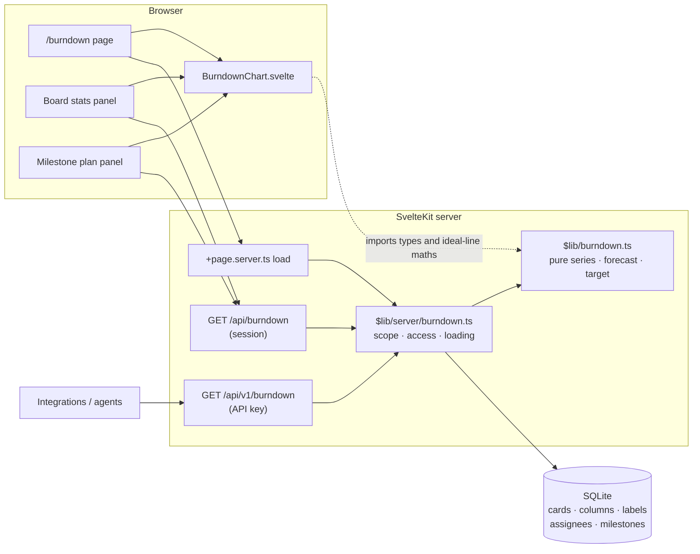
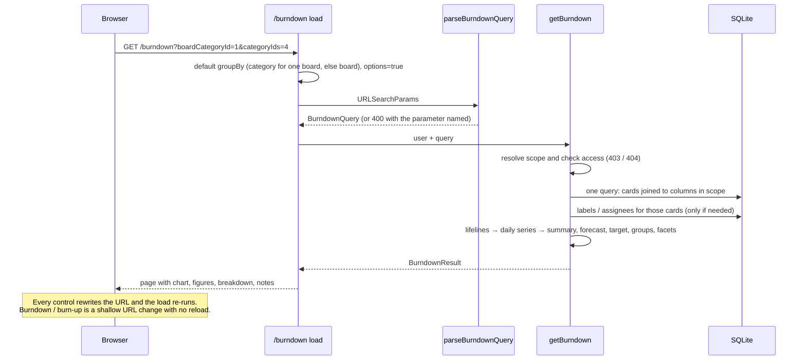
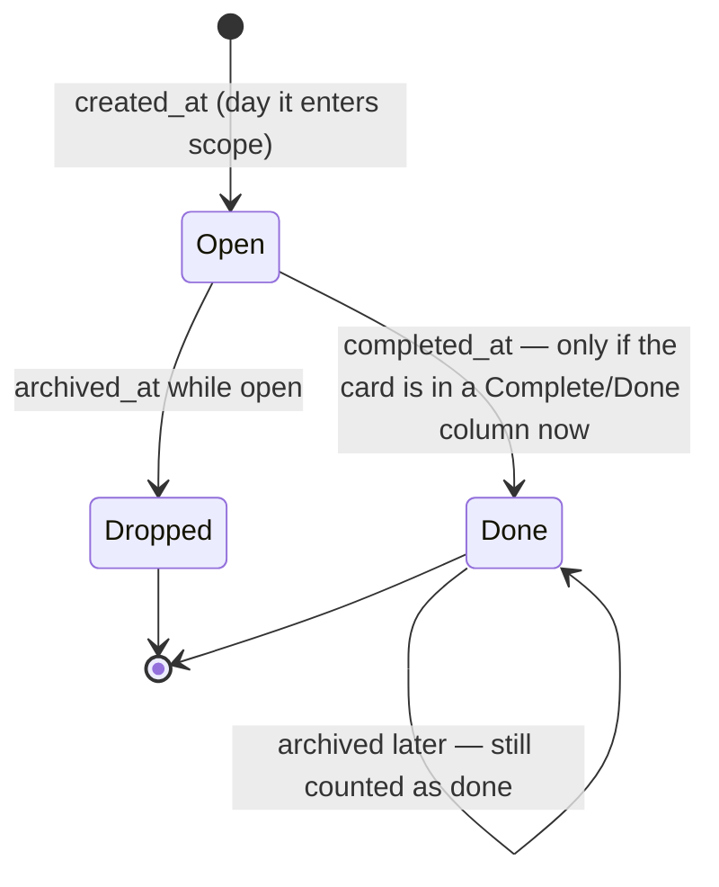
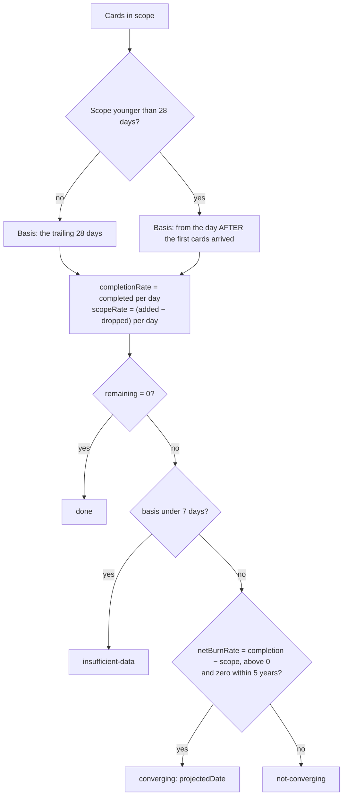
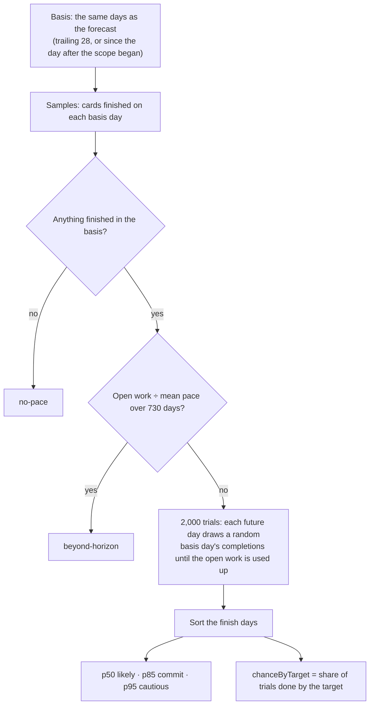
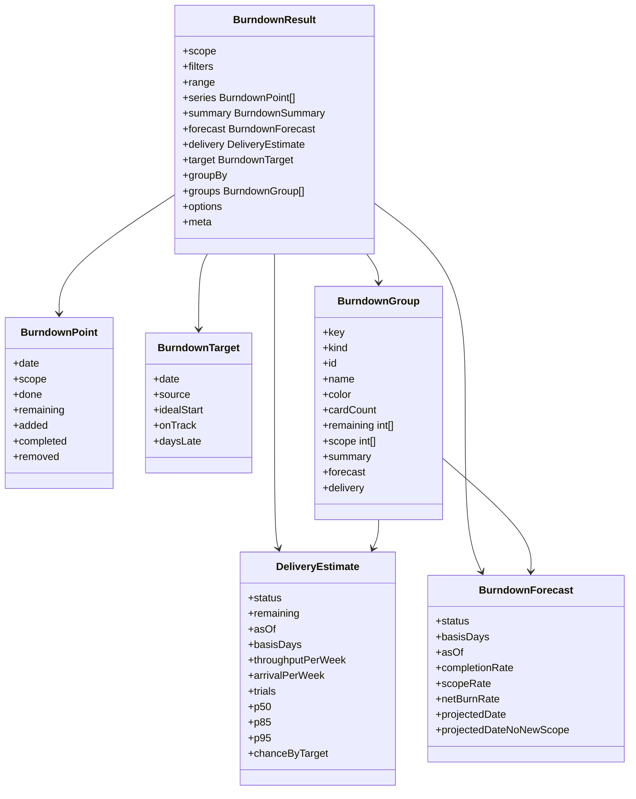

# Burndown Charts

## What it answers

A Kanban board shows what is on it today. A burndown shows whether the work is
**converging on done**: how much was open on each day, whether that is shrinking
or growing, and where it is heading. DumpFire draws one for any slice of the
workspace:

| Scope | What it covers |
|---|---|
| **All boards** | Every board you can see |
| **Boards** | One or more chosen boards |
| **Board group** | Every board in a board category that you can see |
| **Milestone** | The milestone's cards, wherever they live — combine with boards to narrow |

Any scope can be narrowed further by **card category**, **label**, **assignee**
(including "me" and "unassigned") and **priority**, over any window up to two
years.

It appears in three places:

- **`/burndown`** — the full page, from the dashboard's *Burndown* link or a
  board's *More → Burndown*. It opens with a plain-English summary, then six
  figures, the chart and a breakdown. Every control is in the URL, so a view is a
  link.
- **Board → More → Statistics** — a compact 30-day chart for the board, with a
  category selector, a "Done in 2–3 weeks" line and a link to the full page.
- **Milestone plan (`/plan/:id`)** — a Burndown panel with the ideal line to the
  milestone's target date, a one-line verdict (on track, tight, behind or at
  risk) and the time to deliver with the chance of making the date.

Every figure has a **hover explanation**: a themed floating panel saying what the
figure means and how it was worked out, with the real numbers. Keyboard focus and
a tap on a touch screen open it too.

## Reading the page

The summary sentence and the six tiles are written from the same response, so
they never disagree.

| Tile | What it means | How it is worked out (shown on hover) |
|---|---|---|
| **Remaining** | Cards open now: not in Complete, not archived | open at the start + added − finished − dropped |
| **Finished** | Cards that reached Complete in the period | counted on the day each got there; pace = finished in the basis ÷ days × 7 |
| **Added** | New cards in the period, and how many open cards were dropped | net arrivals in the basis ÷ days × 7 |
| **At this pace** | Where the open pile is heading if work keeps arriving and being finished as lately | finishing a week − arriving a week; *Clears 14 Nov*, *Growing*, *Holding steady*, *Stalled* |
| **Time to deliver** | How long the work open **now** would take if nothing new were added | Monte Carlo over real daily completions: likely, 85% and 95% dates |
| **Target** | Will it land by the date? | the chance of finishing by then, from the same simulation |

The controls are one row of pills, each stating the current choice —
`All boards` `Last 30 days` `Filters · 2` `Target 1 Dec` — and each opening a
panel with the detail. Active filters show as removable chips beside the row.

## Architecture



One function, `getBurndown(user, query)`, serves the page, both APIs and both
embeds, so every burndown in the product gives the same answer to the same
question. The maths module is pure — no database, no DOM — so the chart and the
server share it.

### Page load



## Why card timestamps, not snapshots

The first burndown (card #73) read `daily_snapshots`: per-column card counts
captured once a day. That approach has three problems:

1. **Snapshots cannot be filtered.** They are counts per column, so there is no
   way to ask for one category, one label, one assignee or one milestone.
2. **They have gaps.** A snapshot exists only for days the server was running:
   the development database holds 18 snapshot days across five months.
3. **They are time-of-capture, not end-of-day.** A snapshot is taken at the
   first hourly tick, so work added later that day is missing from it.

Every card already records when it arrived, when it was completed and when it
was archived. That is enough to say how much work was open on any day, for any
subset of cards. Reconciled against the stored snapshots, 129 of 130 board-days
matched exactly. The one difference was reason 3: a snapshot taken at 08:41,
before 23 more cards arrived at 11:16.

The **cumulative flow diagram still uses snapshots**. It needs to know which
column a card was in on a past day, which is recorded nowhere else.

## How a card becomes a lifeline



| Rule | Why |
|---|---|
| A card **enters scope** on the UTC day of `created_at` | The day the work existed. |
| It is **done** on the day of `completed_at`, but only while it sits in a Complete/Done column | `completed_at` is stamped on every move into Complete and **never cleared** on the way out. A stamp on a card elsewhere means the card was reopened. |
| A **reopened** card is charted as open for its whole life | When it was reopened is not recorded, so a guessed interval would be invented data. Counted in `meta.reopenedCards`. |
| A card **in Complete with no stamp** uses its last update as its completion day | Such cards predate the stamping fixes. Counted in `meta.inferredCompletionDates`. |
| **Open work that is archived** leaves scope that day | Archive is the soft delete, so this is work dropped without being done. |
| **Finished work that is archived** stays done | Archiving a finished card is housekeeping. Counting it as removed scope would make a burn-up show delivered work going backwards. Counted in `meta.archivedDoneCards`, because scope can then read higher than the board shows. |
| A card completed before it was created is treated as arriving on its completion day | Imports and clock fixes; it never counts as done while not in scope. |
| Every date is **cut to the UTC day** | `created_at` is SQLite's `2026-09-14 09:00:00` and `completed_at` is ISO `2026-09-14T09:00:00.000Z`; the first ten characters are the day either way. |

**Membership is as it stands today.** A card's milestone, category, labels and
assignees are not historised, so they are applied across the whole window — the
same assumption the activity report makes. A card moved between boards counts on
the board it is on now for its whole life. The response's `meta.notes` says so
whenever one of these bears on the chart in front of you, and counts the cards
it affects.

## The series

For each day in the window, at the **end** of that day:

| Field | Meaning |
|---|---|
| `scope` | Cards that have arrived and not been dropped |
| `done` | Of which completed |
| `remaining` | `scope − done` |
| `added` / `completed` / `removed` | What changed that day |

Two identities always hold, and the end-to-end checks assert them on every
response:

- `scope(d) = scope(d−1) + added − removed` and `done(d) = done(d−1) + completed`
- `remainingNow = remainingStart + added − completed − removed`, where the
  `*Start` values are **before** the first day's changes

Two lines are derived from the series for the chart, both relative to the start
of the window:

- **Work in play** = remaining at the start + added since − dropped since. It
  always equals remaining + finished since the start, so the gap between it and
  remaining is exactly what was finished in the window.
- **Finished since start** = the running total of `completed`.

`buildSeries` makes one pass over the cards into a per-day delta map, then one
pass over the days. It is O(cards + days), so a two-year window costs the same
as a fortnight: 5,000 cards over 730 days build in well under 100 ms.

## The forecast



- **Two dates.** `projectedDate` assumes work keeps arriving at its recent pace.
  `projectedDateNoNewScope` assumes nothing more is added. A board where work
  arrives as fast as it is finished has no net date, and **"not converging" is
  the answer, not an error** — it is the question a burndown exists to raise.
- **A young scope is measured from the day after it began.** A milestone is
  usually carded in one burst. Counting that burst as scope growth projected
  remaining work climbing steeply for a goal that had not changed since the day
  it was written down.
- **Beyond five years is not a forecast.** A date a decade away suggests a
  precision that is not there, so it is reported as not converging.

## Time to deliver

"How long will it take to finish?" is a different question from where the pile
is heading. On a board where work arrives as fast as it is finished, the net
forecast never finishes, yet the work open **today** will be done at some point.
The delivery estimate answers that question, as a range with confidence levels,
because a single date sounds more certain than any forecast is.



- **Sampling real calendar days** carries weekends, holidays and bursty weeks
  into the estimate without modelling any of them. With perfectly steady
  throughput the range collapses to the simple arithmetic answer (20 open at 2 a
  day is 10 days at every percentile).
- **Seeded, so it is stable.** The generator (Mulberry32) is seeded from a hash
  of the inputs, so the same data always gives the same estimate and the numbers
  never jitter on a refresh.
- **The work open now, and nothing new.** New work is deliberately left out,
  because that is the question being asked. `arrivalPerWeek` is reported beside
  it, and the page says every new card pushes the dates out.
- Statuses: `estimated`, `done`, `no-pace` (nothing finished in the basis),
  `insufficient-data` (under a week of history), `beyond-horizon` (over two years).
- Each breakdown row gets its own estimate with 500 trials. Twenty deliberately
  slow rows take about 70 ms.

### The target and the ideal line

The ideal line only exists when there is a **target date**: the milestone's own,
or `target=YYYY-MM-DD` (`target=none` hides a milestone's). It runs from the
remaining work at the start of the window to zero on the target date. If the
window opens before any work existed, it starts from the **first day with
work**; otherwise a new milestone would draw a line from zero to zero along the
axis. The old chart's line to zero on the last day of an arbitrary window has
gone, because it meant nothing.

`onTrack` is true when the net forecast lands on or before the target, and false
when it lands after or is not converging. `daysLate` is negative when the
forecast is early.

### The target verdict

The page's Target tile and the milestone panel share one verdict
(`targetVerdict` in `$lib/burndown-text`), so they cannot disagree. Showing the net
forecast and the delivery estimate as separate verdicts once produced "At risk"
beside "79% chance" for the same date, because they answer different questions.
The verdict now leads with the chance:

| Chance of finishing by the target | Verdict |
|---|---|
| 85% or more | **On track** |
| 50–85% | **Tight** |
| under 50% | **Behind** |

When the pile is growing, the chance is stated as holding "if nothing new is
added". With no pace to simulate from, it falls back to the net forecast and
says *At risk* without quoting a percentage: a 0% there would come from having no
data, not from an estimate.

## The chart

`BurndownChart.svelte` is inline SVG with no charting library, the same approach
as the CFD. It is drawn at the container's measured pixel width, so text is 1:1
from the 340 px stats panel to the full page.

| Element | Burndown | Burn-up |
|---|---|---|
| Primary line + wash | Remaining (indigo `#6366f1`) | Finished since start (green `#059669`) |
| Secondary line | Work in play (amber `#d97706`) | Work in play (amber) |
| Dashed | Ideal to the target date | — |
| Dotted | Forecast of remaining | Forecasts of finished and work in play, meeting on the projected date |
| Markers | Today, Target | Today, Target |

**All-time scope is not plotted.** It counts every card that has ever existed,
finished or not. On the all-boards view of real data it ran from 1,450 to 1,812
against 158–200 open, which squashed the remaining line into the bottom tenth of
the chart. Work in play starts at the remaining work, so both lines share one
scale, and the gap between them means something. All-time scope is still in the
hover, the table and the API.

- The **colours are the chart's own tokens**, not the theme accent. They were
  run through the dataviz palette validator against the light and dark surfaces
  and pass the lightness band and 3:1 contrast. Scope and done sit in the
  colour-blind floor band (ΔE 7.9), so they are never told apart by hue alone:
  done carries a wash, the ends carry labels, and the legend names every line.
- **Dashes are reserved for what is not measured** — ideal and forecast.
  Gridlines are solid hairlines.
- The x axis runs past today far enough to show the target and forecast, capped
  at max(14 days, 1.5× the window) so history is never squashed. Anything beyond
  is pointed at from the right edge.
- **Hover** shows a crosshair and a tooltip: the day's remaining, work in play,
  finished since start, the ideal value, all cards ever, and what was added,
  finished and dropped that day.
- **The legend explains itself.** Each entry has a hover explanation. The keys
  are drawn as inline SVG with prefixed classes, because sharing the chart's
  `.area` class once gave the Remaining key the wash's 10% opacity and made it
  almost invisible.
- **Keyboard:** the chart is focusable. ←/→ move a day, Shift+←/→ a week,
  Home/End jump to either end, and each reading is announced through a polite
  live region.
- **Table view:** *Show table* on the full page, plus a CSV of the daily series
  (with `in_play`, `finished_since_start`, `all_cards` and `all_done`). Tooltips
  never gate a value.

### Explanations and controls

`InfoTip.svelte` wraps whatever it explains and opens a `FloatingPanel`: the app's
card surface, border and shadow with the theme's accent along the top, so it
matches every theme. It opens on hover (with a short delay, and a grace period to
move into it), on keyboard focus, or on a tap on a touch screen. It closes on
blur, Escape or a tap elsewhere. `Popover.svelte` is the click-to-open
counterpart behind the control pills: it moves focus into the panel on opening
and returns it to the pill on closing. Both are placed by `placeFloating` (below
the trigger if it fits, above if not, kept on screen, arrow on the trigger) and
portalled to `<body>`, so nothing can clip them.

## API

### `GET /api/v1/burndown` (and `GET /api/burndown` with a session)

| Param | Default | Meaning |
|---|---|---|
| `boardIds` | — | Comma-separated. View access to each is required (403 names the board). |
| `boardCategoryId` | — | Every board in the group **that you can see**. Not with `boardIds`. |
| `milestoneId` | — | The milestone's cards; combine with `boardIds` to narrow. |
| *(none of those)* | — | Every board you can see. |
| `categoryIds` | any | Card categories; `none` = uncategorised. |
| `labelIds` | any | A card matches if it carries any of them. |
| `assigneeIds` | anyone | `me`, `none` (unassigned), or user ids. |
| `priorities` | any | `critical`, `high`, `medium`, `low`. |
| `from`, `to` | last 30 days | UTC days. `to` beyond today is clamped. Not with `days`. |
| `days` | 30 | 1–730, ending at `to`. A milestone defaults to since its creation. |
| `target` | milestone's | `YYYY-MM-DD`, or `none`. |
| `groupBy` | `none` | `board`, `category`, `label`, `assignee`, `priority`. |
| `options` | `false` | `true` adds filter values present in scope, with counts. |

Values within one filter are alternatives; separate filters must all hold. Every
problem is a **400 naming the parameter** — a silently ignored filter produces a
chart that looks right and answers a different question.



- **Groups** carry `remaining[]` and `scope[]` as bare arrays aligned to the
  series dates. Twenty groups of full points over a year would be half a
  megabyte. Board and priority groups partition the cards and sum to the whole.
  Label and assignee groups do not: a card with two labels is in both.
- **Options are faceted.** Each facet is counted with every *other* filter
  applied, so choosing a label never hides the labels you could switch to.
- **Read `meta.notes` before quoting a figure.** It lists only the caveats that
  bear on this result: inferred completion dates, reopened cards, archived
  finished cards, membership applied today, cards moved in from other boards,
  and boards in a group that are hidden from you.
- **`meta.inferredInWindow`** counts how many cards with no completion stamp have
  their stand-in date (the last update) inside the window. Those are the only
  ones that can inflate the finished figure, and the note says by how many:
  "12 of them fall in this period, so up to 12 of the 354 completions here may
  have happened earlier."

```bash
# How is the Development group doing, by board, over the last quarter?
curl -H "Authorization: Bearer $DUMPFIRE_KEY" \
  "$BASE/api/v1/burndown?boardCategoryId=1&days=90&groupBy=board"

# Will milestone 16 land by its date?
curl -H "Authorization: Bearer $DUMPFIRE_KEY" \
  "$BASE/api/v1/burndown?milestoneId=16" | jq '{delivery, target}'
```

## Access

- Explicit boards need view access to **each** one; one forbidden board fails the
  whole request with a 403 that names it.
- A board group is intersected with your accessible boards and never widened. A
  note says how many of its boards are hidden from you.
- A milestone goes through `requireMilestone`. For a cross-board goal that already
  requires view access to every board its cards touch, so its cards can be loaded
  without a board list.
- *All boards* means `getAccessibleBoardIds`: everything for an admin, and owned,
  member, team and public boards for everyone else.

## Files

| File | Role |
|---|---|
| `src/lib/burndown.ts` | Pure: types, `buildSeries`, `summarise`, `workInPlay`, `finishedSinceStart`, `forecast`, `forecastBasis`, `estimateDelivery`, `assessTarget`, `idealRemaining`, day arithmetic |
| `src/lib/burndown-text.ts` | Plain-English wording shared by the page and both panels: `paceText`, `deliveryText`, `targetVerdict`, `durationRange`, `chancePercent` |
| `src/lib/floating.ts` | `placeFloating` (pure placement) and the `portal` action |
| `src/lib/components/FloatingPanel.svelte` | The themed floating canvas |
| `src/lib/components/InfoTip.svelte` | Hover / focus / tap explanations |
| `src/lib/components/Popover.svelte` | The click-to-open control pills |
| `src/lib/server/burndown.ts` | `parseBurndownQuery`, `getBurndown`: scope resolution, access, card loading, groups, facets, notes |
| `src/routes/api/burndown/+server.ts` | Session endpoint for the embeds |
| `src/routes/api/v1/burndown/+server.ts` | API-key endpoint |
| `src/routes/burndown/+page.server.ts`, `+page.svelte` | The full page |
| `src/lib/components/board/BurndownChart.svelte` | The chart |
| `src/lib/components/Sparkline.svelte` | Breakdown-row trend lines |
| `src/lib/components/board/StatsPanel.svelte` | Compact board chart |
| `src/routes/plan/[id]/+page.svelte` | Milestone burndown panel |

The snapshot-based `GET /api/boards/:id/burndown` route was removed. Its only
caller was the stats panel.

## Known limits

- Membership (milestone, category, label, assignee) and board are as they stand
  today, applied to the whole window.
- A reopened card's earlier completion is not shown.
- Cards count equally. There are no estimates on cards by design, and token cost
  is measured after the work, so it cannot size what remains.
- The delivery estimate replays the recent pace. It cannot foresee a change in
  who is working on the scope, and it leaves new arrivals out on purpose.
- Days are UTC, like the snapshots and the activity report. Work completed just
  after midnight BST lands on the previous UTC day.
