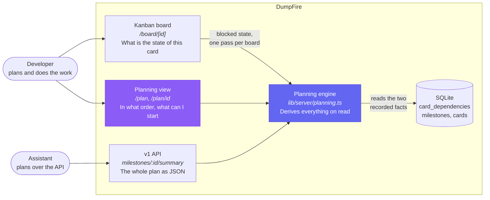
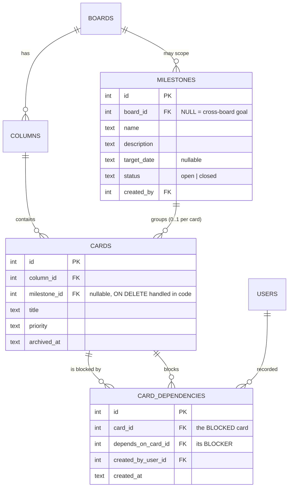
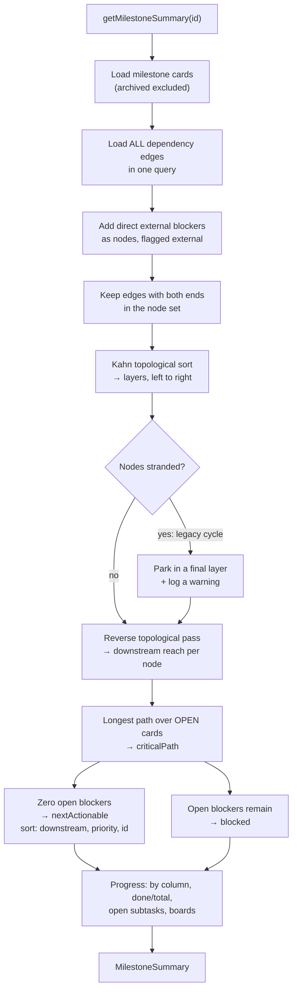
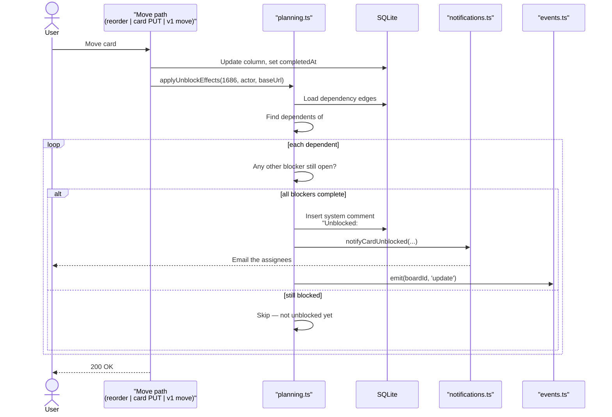

# Critical-Path Planning

## The problem

A Kanban board is good at "what is the state of this card" and has nothing to say about
"in what order does this have to happen". A board with 69 To Do, 13 On Hold and 10 In
Progress cards has no structure beyond priority. A goal such as *migrate all environments
to Azure VMs* has prerequisites that must land in a particular order — cloud test
environment, secrets management, network segmentation, backup restore drills, DNS cutover,
decommissioning — and without somewhere to record that order it lives in people's heads and
in markdown plans that go stale.

## The principle

**Record only facts that are cheap to keep true.** DumpFire stores exactly two planning
facts by hand:

1. **Which card blocks which** — `card_dependencies`
2. **Which milestone a card belongs to** — `cards.milestone_id`

Everything else — the critical path, what is startable today, what is blocked and by what,
how much finishing a card would unblock, percent complete — is **computed on read** in
`src/lib/server/planning.ts`. Nothing derived is stored, so nothing derived can drift.

There are deliberately **no start or end dates on cards** and no estimates. A chain of cards
is enough to say what cannot slip. Per-card dates, resource levelling, hours tracking and
drag-to-reschedule Gantt charts are the features that make planning tools go stale for a
one- or two-person team, and they are out of scope.

## Where it sits

The planning view at `/plan` is a **separate view**, not a mode of the board. Same cards,
different question. The Kanban board is untouched apart from two chips on the card face and
one filter.



## Data model

Two tables and one column carry every planning fact.



### Edge direction

Stated once, because getting it backwards is the easiest mistake here:

- `card_dependencies.card_id` is the card that is **blocked**
- `card_dependencies.depends_on_card_id` is its **blocker**

An edge points **blocker → blocked**, which is also the left-to-right reading order of the
milestone graph. The API accepts both spellings (`dependsOnCardId` and `blocksCardId`) so a
caller never has to work out which end owns the row.

### Constraints worth knowing

| Constraint | Why |
|------------|-----|
| `UNIQUE (card_id, depends_on_card_id)` | The duplicate check used to be handler-only. Migration `0042` de-duplicates to `MIN(id)` per pair before creating the index, or it fails on live data. |
| `cards.milestone_id` has no `REFERENCES` clause | SQLite cannot add a column with `ON DELETE` to an existing table. The delete handler nulls it instead — which is the wanted behaviour anyway: **deleting a goal must never delete the work.** |
| `milestones.board_id` nullable | A goal can span several projects. A migration touches more than one board. |
| Archived cards are excluded everywhere | An archived blocker is not a live dependency. |

### What counts as "done"

A dependency is resolved when its blocker sits in a **Complete** column, decided by
`isCompleteColumnTitle()` in `card-completion.ts` — the same strict helper the rest of the
app uses for XP and completion blocking. One definition of done across the whole app; two
would be exactly the drift this feature exists to remove.

## How a milestone summary is computed



### Design decisions inside that flow

**External blockers are included.** The node set is the milestone's cards *plus* any card
outside it that directly blocks one of them, marked `external: true`. Without them, a card
whose only blocker sits on another board would appear startable when it is not — precisely
the mistake the feature exists to prevent. Direct blockers only: one level is exactly what
"can I start this" depends on. External nodes are never offered in `nextActionable`; they
are context, not scope.

**The critical path covers open work only.** It is the longest chain of dependencies among
cards that are not yet complete. A finished prerequisite adds no risk, so it drops out and
the chain shortens as work lands. Ties break on accumulated priority, then on the lowest
card id, so the highlighted chain does not jitter between reloads. A chain of one card is
not reported — that is just the next thing to do, and it shows up in `nextActionable`.

**Next-actionable is sorted by how much it unblocks.** `downstreamCount` is the number of
open cards transitively reachable from a card. On a one- or two-person team, the card that
frees the most downstream work is the one worth starting, ahead of raw priority.

**The whole edge table is read in one query.** It is small — one row per ordering decision
somebody actually made, not one per card — and cycle detection, downstream counts and the
critical path all walk it repeatedly. Paging it would cost more queries than it saves rows.

**Complexity.** Layering, reach and longest-path are each a single pass over nodes and
edges: O(V + E) per summary, with one bounded query for cards, one for columns, one for
boards and one for the edge table.

### Cycle detection

Adding "blocker B blocks card A" closes a loop exactly when B is already reachable
*downstream* of A. `findDependencyCycle(blockedId, blockerId)` walks forward from A over
blocker → blocked edges looking for B, and returns the offending chain as card ids rather
than a boolean — so the API can name the cycle it rejected:

```json
{ "error": "That dependency would create a cycle",
  "cycle": [1559, 1686, 1198],
  "message": "Cycle: #1559 → #1686 → #1198 → #1559" }
```

"Rejected" on its own is not useful when the loop runs through five cards on three boards.

## Unblock notification

When a card reaches a Complete column, anything that was waiting only on it becomes
startable. Three code paths complete a card, so the reaction lives in one helper,
`applyUnblockEffects()`, and each of them calls it in one line.



The helper swallows its own errors. A card that has genuinely been completed must not fail
to move because an email bounced.

The email reuses the existing `email_moved` preference rather than introducing a new
toggle: being unblocked is a column change on somebody else's card, and a user who muted
move notifications does not want this one either.

## Upgrading a live system

This feature adds a migration, so it is worth being explicit about what it does to a
populated database.

**Additive by default.** Migration `0042` creates the `milestones` table, adds two nullable
columns (`cards.milestone_id`, `card_dependencies.created_by_user_id`) and three indexes.
SQLite adds a nullable column as a schema change, not a table rewrite, so no existing row is
read or written.

**One statement removes anything.** Before this migration the duplicate check for
dependencies lived in the request handler rather than the database, so identical
`(card_id, depends_on_card_id)` pairs were possible and `CREATE UNIQUE INDEX` would fail on
them. The de-dupe keeps `MIN(id)` of each pair and groups on exactly the two columns the
index covers, which makes losing a dependency unrepresentable: a row can only be deleted
when another row with the same pair survives.

**Legacy table shapes are repaired in code, not SQL.** `repairLegacyCardDependencies()` in
`migrate.ts` runs before the migration loop. It inspects `card_dependencies`, does nothing
when the columns are already current, refuses to touch a shape it does not recognise, and
converts a genuinely legacy table inside a transaction that compares row counts and rolls
back rather than dropping the original if they disagree.

That check exists in code because plain SQL cannot ask "which shape is this table?" — the
assumption that it could is precisely what made migration `0036` destructive (see the
comment in that file). Putting it where it can be guarded, counted and rolled back is the
difference between a conversion and a data-loss bug.

**Verified, not assumed.** The upgrade was run against three populated databases — one at
`0041` with several hundred cards, comments, subtasks and assignees; the same database
forced into the legacy dependency shape; and a real working database already upgraded. In
every case cards, comments, subtasks and assignees were preserved, every distinct dependency
survived (with blocker/blocked mapped the right way round on conversion), and two further
simulated restarts re-ran no migration and changed no row.

That last property matters most: a migration that does work on every boot rather than once
is exactly the failure mode `0036` had, and it went unnoticed for months because the table
it emptied was never read.

## The planning view

`/plan` lists the goals. `/plan/[id]` is one milestone, rendering five blocks in the order
they answer a real question:

| Block | Question it answers |
|-------|---------------------|
| Progress | How far along is this goal |
| Critical path | Which chain cannot slip |
| Next actionable | What can I start today |
| Blocked | What is waiting, and on what |
| Dependency graph | What is the overall shape |

Nothing is computed in the browser. The server hands over a `MilestoneSummary` and the page
draws it, so the page and the API can never disagree about what the critical path is.

### Why the graph is hand-laid-out SVG

The milestone graph is inline SVG positioned in topological layers, **not** the existing
`ForceGraph` component used by `/graph`. The point of this graph is that reading left to
right is reading the order the work happens in, and a force layout scrambles exactly that.

Nodes keep a fixed size (190×58) and the container scrolls horizontally; shrinking nodes to
fit thirty cards on one screen produces a picture nobody can read. The page body itself
never scrolls sideways.

| Node state | Appearance |
|------------|------------|
| On the critical path | Red border, heavier stroke; its edges drawn red and thicker |
| Complete | Green, text dimmed so finished work recedes |
| Blocked | Amber |
| Startable | Indigo |
| Outside the milestone | Dashed grey border |

Cards with no dependencies recorded in either direction appear in a **Parallel / unordered**
group beneath the graph, so a card is never invisible just because nobody sequenced it.

## Board integration

The board picks up exactly three things:

- A **Blocked** chip on the card face when any blocker is not in a Complete column, with a
  tooltip listing each blocker, its column, and its board when it lives on another one.
  Amber, not red — On Hold already owns red, and *waiting* must stay distinguishable from
  *stopped*.
- A **milestone** chip linking through to the planning view.
- A **Hide blocked** filter, which also adjusts the per-column counts so a filtered column
  reads `3/12` rather than silently under-reporting.

Blocked state is computed once per board by `getBoardBlockedState()` and shipped with the
page payload — one query for the whole board rather than one request per card face.

Moving a blocked card to In Progress **stays allowed**; it raises a warning toast naming the
outstanding blockers rather than a modal. A dialog that interrupts the drag would make the
common case — the graph is out of date and you know what you are doing — annoying enough to
stop people recording dependencies at all.

## Planning over the API

`GET /api/v1/milestones/:id/summary` returns the whole plan in one payload, and is the call
to make to answer *"what should I work on next for milestone X"*. Add `?compact=true` to
drop the graph (the bulky part, only needed for drawing) and get a `cardTitles` map instead.

From the wrapper script:

```powershell
.\.agent\scripts\dumpfire-api.ps1 -Action milestone-summary -ApiKey <KEY> -MilestoneId 4 -NoGraph
```

Use `-NoGraph`, never `-Compact`: the wrapper's `-Compact` trims responses to
`id`/`title`/`status` fields, which would discard the plan itself.

See [External API Reference](api-reference.md) and `.agent/workflows/dumpfire-api-reference.md`
for the full endpoint contracts.

## Files

| File | Responsibility |
|------|----------------|
| `drizzle/0042_add_milestones_and_planning.sql` | Milestones table, `cards.milestone_id`, unique dependency pair index |
| `src/lib/server/planning.ts` | Every derived planning fact — graph, cycles, critical path, actionable, unblock hook |
| `src/lib/server/milestones.ts` | Milestone CRUD, card assignment, access rules |
| `src/routes/api/v1/milestones/**` | Bearer-token API |
| `src/routes/api/milestones/**`, `src/routes/api/cards/[id]/dependencies` | Session-cookie siblings for the UI |
| `src/routes/plan/**` | The planning view |
| `src/lib/components/CardModal.svelte` | Dependency editor and milestone picker |

## Out of scope

Per-card start and end dates, estimates, duration-weighted critical path, resource
levelling, hours tracking, and Gantt charts with drag-to-reschedule. Estimates and a
duration-weighted path may be worth revisiting once the card-count critical path has been
used in anger for a while — but only then.
