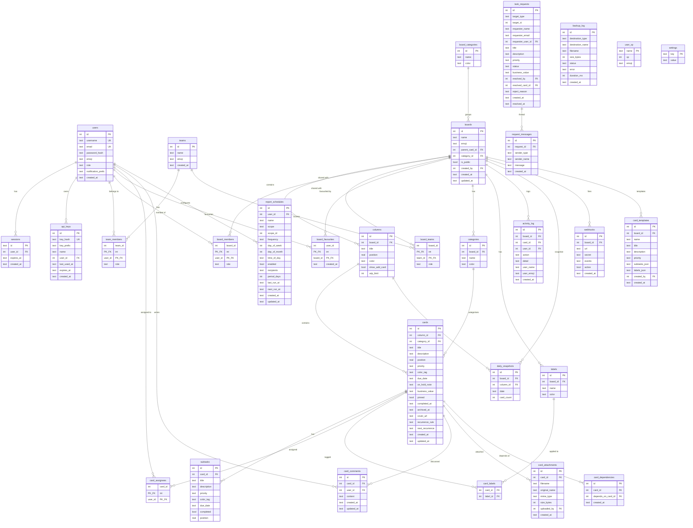
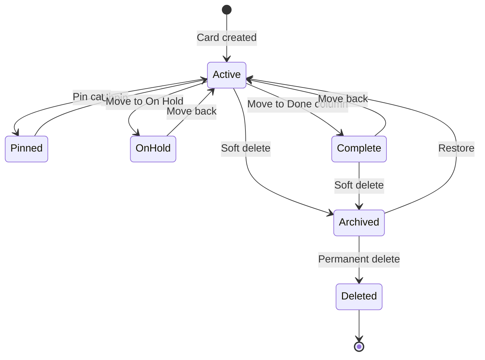

# DumpFire Data Model

DumpFire uses SQLite as its embedded database, managed by Drizzle ORM. The schema is defined in `src/lib/server/db/schema.ts` and migrations live in `drizzle/`.

## Entity-Relationship Diagram

## Cascade Behaviour

| Parent | Child | On Delete |
|--------|-------|-----------|
| `users` | `sessions` | CASCADE |
| `users` | `api_keys` | CASCADE |
| `users` | `team_members` | CASCADE |
| `users` | `board_members` | CASCADE |
| `users` | `card_assignees` | CASCADE |
| `users` | `card_comments` | CASCADE |
| `boards` | `columns` | CASCADE |
| `boards` | `board_members` | CASCADE |
| `boards` | `labels` | CASCADE |
| `boards` | `activity_log` | CASCADE |
| `boards` | `webhooks` | CASCADE |
| `columns` | `cards` | CASCADE |
| `cards` | `subtasks` | CASCADE |
| `cards` | `card_assignees` | CASCADE |
| `cards` | `card_labels` | CASCADE |
| `cards` | `card_comments` | CASCADE |
| `cards` | `card_attachments` | CASCADE |
| `categories` | `cards.categoryId` | SET NULL |
| `boards` | `boards.createdBy` | SET NULL |

## Card Lifecycle

## Key Schema Notes

- **All timestamps** are stored as ISO 8601 text strings with `datetime('now')` default
- **Positions** use `real` float type for fractional ordering — allows inserting between items without reordering all rows
- **Sub-boards** are regular boards with a `parent_card_id` linking them to a card
- **Soft delete** uses the `archived_at` column — a non-null value means the card is archived
- **XP system** uses a separate `user_xp` table keyed by username for historical tracking
- **Settings** is a simple key-value store for SMTP config, app URL, etc.
