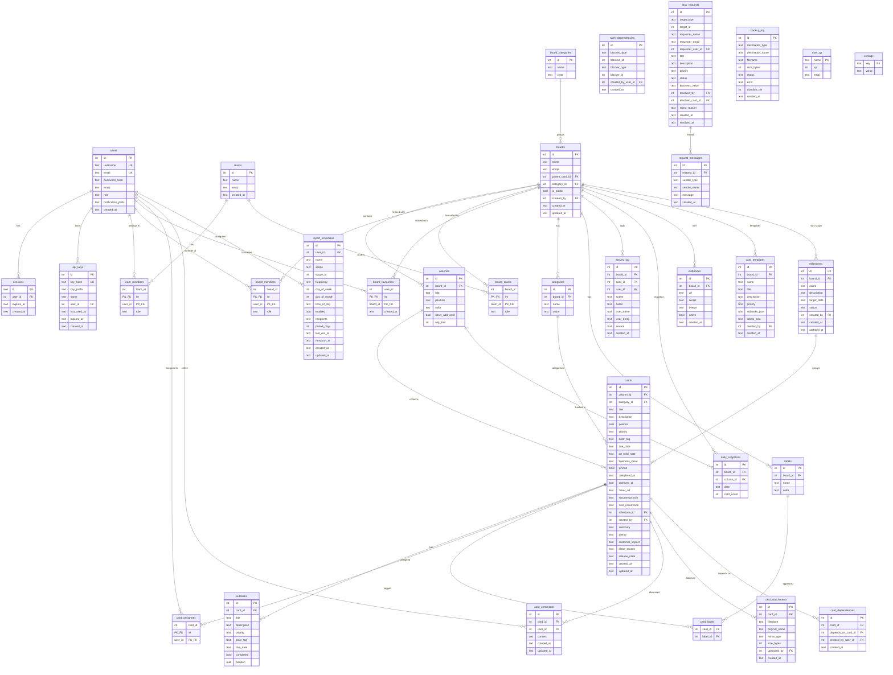
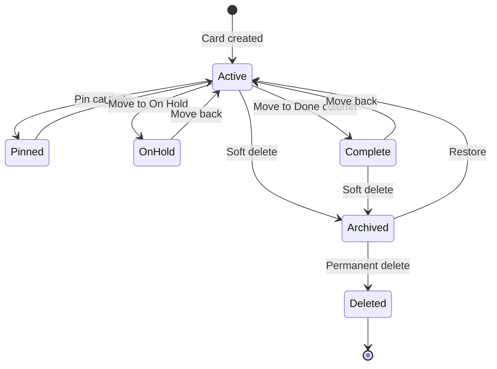

# DumpFire Data Model

DumpFire uses SQLite as its embedded database, managed by Drizzle ORM. The schema is defined in `src/lib/server/db/schema.ts` and migrations live in `drizzle/`.

## Entity-Relationship Diagram

```mermaid
erDiagram
    users {
        int id PK
        text username UK
        text email UK
        text password_hash
        text emoji
        text role
        text notification_prefs
        text created_at
    }

    sessions {
        text id PK
        int user_id FK
        text expires_at
        text created_at
    }

    teams {
        int id PK
        text name
        text emoji
        text created_at
    }

    team_members {
        int team_id PK_FK
        int user_id PK_FK
        text role
    }

    api_keys {
        int id PK
        text key_hash UK
        text key_prefix
        text name
        int user_id FK
        text last_used_at
        text expires_at
        text created_at
    }

    board_categories {
        int id PK
        text name
        text color
    }

    boards {
        int id PK
        text name
        text emoji
        int parent_card_id FK
        int category_id FK
        bool is_public
        int created_by FK
        text created_at
        text updated_at
    }

    board_members {
        int board_id PK_FK
        int user_id PK_FK
        text role
    }

    board_teams {
        int board_id PK_FK
        int team_id PK_FK
        text role
    }

    board_favourites {
        int user_id PK_FK
        int board_id PK_FK
        text created_at
    }

    columns {
        int id PK
        int board_id FK
        text title
        real position
        text color
        bool show_add_card
        int wip_limit
    }

    categories {
        int id PK
        int board_id FK
        text name
        text color
    }

    cards {
        int id PK
        int column_id FK
        int category_id FK
        text title
        text description
        real position
        text priority
        text color_tag
        text due_date
        text on_hold_note
        text business_value
        bool pinned
        text completed_at
        text archived_at
        text cover_url
        text recurrence_rule
        text next_recurrence
        int milestone_id FK
        int created_by FK
        text summary
        text theme
        text customer_impact
        text close_reason
        text release_state
        text created_at
        text updated_at
    }

    subtasks {
        int id PK
        int card_id FK
        text title
        text description
        text priority
        text color_tag
        text due_date
        bool completed
        real position
    }

    card_assignees {
        int card_id PK_FK
        int user_id PK_FK
    }

    labels {
        int id PK
        int board_id FK
        text name
        text color
    }

    card_labels {
        int card_id FK
        int label_id FK
    }

    card_comments {
        int id PK
        int card_id FK
        int user_id FK
        text content
        text created_at
        text updated_at
    }

    card_attachments {
        int id PK
        int card_id FK
        text filename
        text original_name
        text mime_type
        int size_bytes
        int uploaded_by FK
        text created_at
    }

    card_dependencies {
        int id PK
        int card_id FK
        int depends_on_card_id FK
        int created_by_user_id FK
        text created_at
    }

    work_dependencies {
        int id PK
        text blocked_type
        int blocked_id
        text blocker_type
        int blocker_id
        int created_by_user_id FK
        text created_at
    }

    milestones {
        int id PK
        int board_id FK
        text name
        text description
        text target_date
        text status
        int created_by FK
        text created_at
        text updated_at
    }

    card_templates {
        int id PK
        int board_id FK
        text name
        text title
        text description
        text priority
        text subtasks_json
        text labels_json
        int created_by FK
        text created_at
    }

    activity_log {
        int id PK
        int board_id FK
        int card_id FK
        int user_id FK
        text action
        text detail
        text user_name
        text user_emoji
        text source
        text created_at
    }

    daily_snapshots {
        int id PK
        int board_id FK
        int column_id FK
        text date
        int card_count
    }

    task_requests {
        int id PK
        text target_type
        int target_id
        text requester_name
        text requester_email
        int requester_user_id FK
        text title
        text description
        text priority
        text status
        text business_value
        int resolved_by FK
        int resolved_card_id FK
        text reject_reason
        text created_at
        text resolved_at
    }

    request_messages {
        int id PK
        int request_id FK
        text sender_type
        text sender_name
        text message
        text created_at
    }

    webhooks {
        int id PK
        int board_id FK
        text url
        text secret
        text events
        bool active
        text created_at
    }

    report_schedules {
        int id PK
        int user_id FK
        text name
        text scope
        int scope_id
        text frequency
        int day_of_week
        int day_of_month
        text time_of_day
        bool enabled
        text recipients
        int period_days
        text last_run_at
        text next_run_at
        text created_at
        text updated_at
    }

    backup_log {
        int id PK
        text destination_type
        text destination_name
        text filename
        int size_bytes
        text status
        text error
        int duration_ms
        text created_at
    }

    user_xp {
        text name PK
        int xp
        text emoji
    }

    settings {
        text key PK
        text value
    }

    users ||--o{ sessions : "has"
    users ||--o{ api_keys : "owns"
    users ||--o{ team_members : "belongs to"
    teams ||--o{ team_members : "has"
    users ||--o{ board_members : "member of"
    users ||--o{ board_favourites : "favourites"
    users ||--o{ card_assignees : "assigned to"
    users ||--o{ card_comments : "writes"
    users ||--o{ report_schedules : "configures"

    boards ||--o{ columns : "contains"
    boards ||--o{ board_members : "shared with"
    boards ||--o{ board_teams : "shared with"
    boards ||--o{ board_favourites : "favourited by"
    boards ||--o{ categories : "has"
    boards ||--o{ labels : "has"
    boards ||--o{ activity_log : "logs"
    boards ||--o{ daily_snapshots : "snapshot"
    boards ||--o{ webhooks : "fires"
    boards ||--o{ card_templates : "templates"
    board_categories ||--o{ boards : "groups"
    teams ||--o{ board_teams : "access"

    columns ||--o{ cards : "contains"
    columns ||--o{ daily_snapshots : "tracked in"
    cards ||--o{ subtasks : "has"
    cards ||--o{ card_assignees : "assigned"
    cards ||--o{ card_labels : "tagged"
    cards ||--o{ card_comments : "discussed"
    cards ||--o{ card_attachments : "attached"
    cards ||--o{ card_dependencies : "depends on"
    boards ||--o{ milestones : "may scope"
    milestones ||--o{ cards : "groups"
    categories ||--o{ cards : "categorises"
    labels ||--o{ card_labels : "applied to"

    task_requests ||--o{ request_messages : "thread"
```

## Cascade Behaviour

| Parent | Child | On Delete |
|--------|-------|-----------|
| `users` | `sessions` | CASCADE |
| `users` | `api_keys` | CASCADE |
| `users` | `team_members` | CASCADE |
| `users` | `board_members` | CASCADE |
| `users` | `card_assignees` | CASCADE |
| `users` | `card_comments` | CASCADE |
| `boards` | `columns` | CASCADE |
| `boards` | `board_members` | CASCADE |
| `boards` | `labels` | CASCADE |
| `boards` | `activity_log` | CASCADE |
| `boards` | `webhooks` | CASCADE |
| `columns` | `cards` | CASCADE |
| `cards` | `subtasks` | CASCADE |
| `cards` | `card_assignees` | CASCADE |
| `cards` | `card_labels` | CASCADE |
| `cards` | `card_comments` | CASCADE |
| `cards` | `card_attachments` | CASCADE |
| `cards` | `card_dependencies` | CASCADE (both ends) |
| `cards` / `subtasks` | `work_dependencies` | **none — cleared in code** |
| `boards` | `milestones` | CASCADE |
| `milestones` | `cards.milestoneId` | SET NULL — **in code, not SQL** |
| `categories` | `cards.categoryId` | SET NULL |
| `boards` | `boards.createdBy` | SET NULL |

`work_dependencies` holds dependencies between any two pieces of work — card or subtask —
in one polymorphic table, so the planning engine walks a single graph. Polymorphic ids
cannot carry a foreign key, so deleting a card or subtask clears its edges in code
(`removeWorkNodeEdges`). It supersedes `card_dependencies`, which migration 0043 copied
across and left in place; nothing reads the old table.

`milestones → cards.milestoneId` is nulled by the delete handler rather than by a foreign
key: SQLite cannot add a column with an `ON DELETE` clause to an existing table, and the
behaviour matters — **deleting a goal must never delete the work**. The delete response
reports how many cards were released.

See [Critical-Path Planning](critical-path-planning.md) for how `card_dependencies` and
`milestones` are read to derive the critical path and what is startable.

## Card Lifecycle

```mermaid
stateDiagram-v2
    [*] --> Active : Card created
    Active --> Pinned : Pin card
    Pinned --> Active : Unpin
    Active --> OnHold : Move to On Hold
    OnHold --> Active : Move back
    Active --> Complete : Move to Done column
    Complete --> Active : Move back
    Active --> Archived : Soft delete
    Complete --> Archived : Soft delete
    Archived --> Active : Restore
    Archived --> Deleted : Permanent delete
    Deleted --> [*]
```

## Key Schema Notes

- **Timestamps come in two shapes, and they do not sort against each other.**
  Columns defaulted by SQLite write `2026-04-09 13:53:46` (`datetime('now')`);
  columns set from application code write `2026-04-09T13:54:01.210Z`
  (`toISOString()`). Both are UTC. A space (`0x20`) sorts *before* `T` (`0x54`),
  so comparing the two forms as strings — which is how every date filter in this
  codebase works — gives the wrong answer: `'2026-09-14 09:00:00' <
  '2026-09-14T00:00:00.000Z'` is **true**.

  | Shape | Columns |
  |---|---|
  | `YYYY-MM-DD HH:MM:SS` | `cards.created_at`, `activity_log.created_at`, `card_comments.created_at` |
  | ISO 8601 with `Z` | `cards.completed_at`, `cards.updated_at` |

  Any query spanning both must normalise first. The reporting code does this with
  `replace(substr(col, 1, 19), 'T', ' ')` on both sides; see
  [Management Activity Reporting](management-reporting.md). Getting it wrong
  silently includes or excludes a whole day at a window boundary.
- **Positions** use `real` float type for fractional ordering — allows inserting between items without reordering all rows
- **Sub-boards** are regular boards with a `parent_card_id` linking them to a card
- **Soft delete** uses the `archived_at` column — a non-null value means the card is archived
- **XP system** uses a separate `user_xp` table keyed by username for historical tracking
- **Settings** is a simple key-value store for SMTP config, app URL, etc.
- **Reporting fields** (`summary`, `theme`, `customer_impact`, `close_reason`,
  `release_state`) are nullable and never backfilled — a null is "not recorded",
  which is a different and more honest answer than a guess. Vocabularies are
  enforced in the application rather than by `CHECK` constraints, because they
  will change and SQLite cannot alter a `CHECK` without rebuilding the table.
- **`cards.created_by`** records who raised a card; null for cards created before
  it existed. **`activity_log.source`** records `ui` or `api`; null on older rows,
  where the `api:` prefix on `action` carries the same fact and readers derive it.
