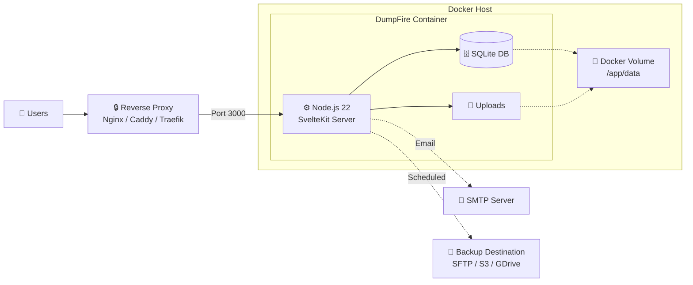
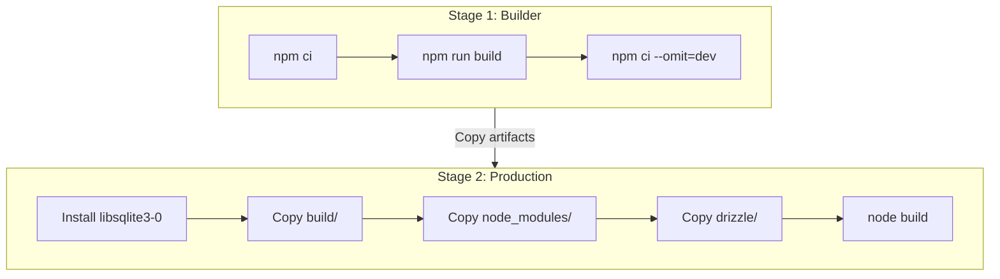
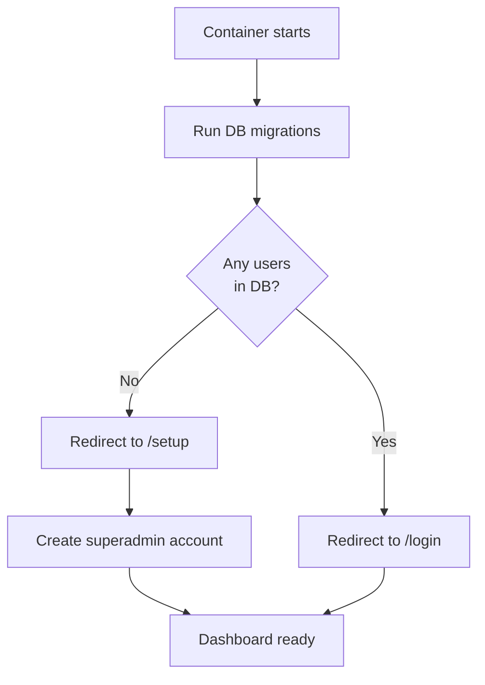
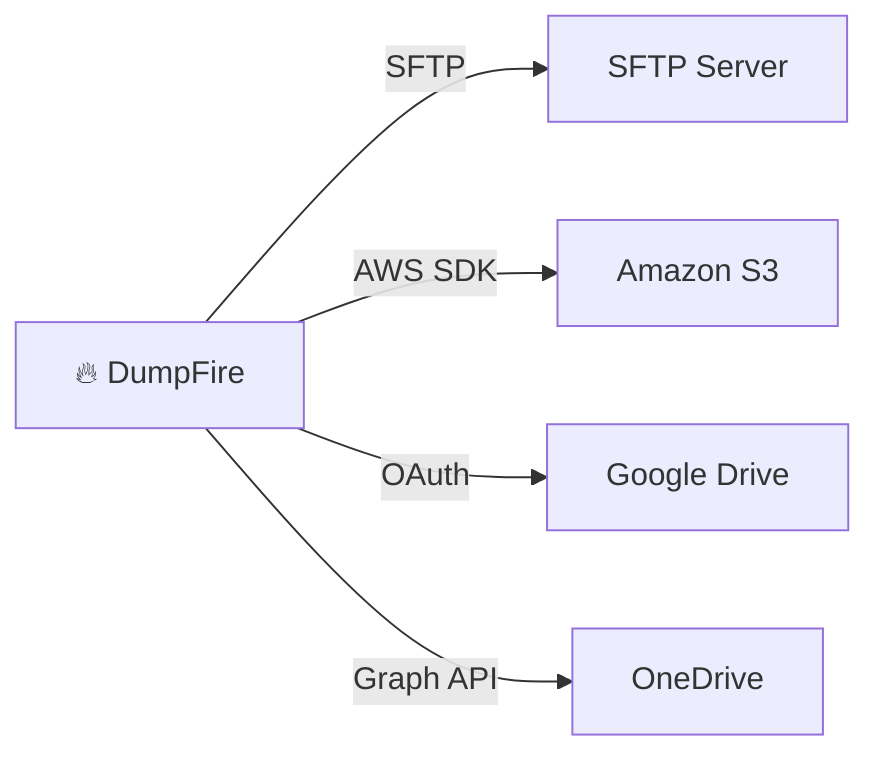

# DumpFire Deployment Guide

DumpFire is deployed as a single Docker container running Node.js 22 with an embedded SQLite database. No external database server is required.

## Deployment Architecture



## Docker Build

The Dockerfile uses a two-stage build for minimal image size:



### Build Command

```bash
docker build -t dumpfire:latest .
```

## Environment Variables

| Variable | Default | Required | Description |
|----------|---------|----------|-------------|
| `NODE_ENV` | `production` | No | Node.js environment mode |
| `PORT` | `3000` | No | HTTP port the server listens on |
| `ORIGIN` | `http://localhost:3000` | **Yes** | Public URL — must match your domain exactly. Incorrect value causes CSRF failures |
| `PROTOCOL_HEADER` | `X-Forwarded-Proto` | No | Header from reverse proxy indicating HTTPS |
| `HOST_HEADER` | `X-Forwarded-Host` | No | Header from reverse proxy with original hostname |

> ⚠️ **CRITICAL**: `ORIGIN` must be set to your actual public URL (e.g. `https://dumpfire.example.com`). Leaving it as localhost will cause CSRF token validation failures on all form submissions.

## Running

### Minimal

```bash
docker run -d \
  --name dumpfire \
  -p 3000:3000 \
  -v dumpfire-data:/app/data \
  -e ORIGIN=http://localhost:3000 \
  dumpfire:latest
```

### Production

```bash
docker run -d \
  --name dumpfire \
  --restart unless-stopped \
  -p 3000:3000 \
  -v dumpfire-data:/app/data \
  -e ORIGIN=https://dumpfire.example.com \
  -e NODE_ENV=production \
  dumpfire:latest
```

### Docker Compose

```yaml
version: '3.8'

services:
  dumpfire:
    build: .
    container_name: dumpfire
    restart: unless-stopped
    ports:
      - "3000:3000"
    volumes:
      - dumpfire-data:/app/data
    environment:
      - ORIGIN=https://dumpfire.example.com
      - NODE_ENV=production

volumes:
  dumpfire-data:
```

## Volume Mounts

| Container Path | Purpose | Persist? |
|---------------|---------|----------|
| `/app/data` | SQLite database + uploaded attachments | **Yes — required** |
| `/app/data/dumpfire.db` | Main database file | Auto-created |
| `/app/data/uploads/` | Card attachments | Auto-created |

> 💡 Always mount `/app/data` as a Docker volume. Without it, all data is lost when the container is recreated.

## First-Run Setup



1. Start the container
2. Visit the application URL
3. You'll be redirected to `/setup` to create the first superadmin account
4. After setup, `/setup` is permanently blocked

## Reverse Proxy — Nginx

```nginx
server {
    listen 443 ssl http2;
    server_name dumpfire.example.com;

    ssl_certificate     /etc/ssl/certs/dumpfire.pem;
    ssl_certificate_key /etc/ssl/private/dumpfire.key;

    location / {
        proxy_pass http://localhost:3000;
        proxy_http_version 1.1;
        proxy_set_header Host $host;
        proxy_set_header X-Real-IP $remote_addr;
        proxy_set_header X-Forwarded-For $proxy_add_x_forwarded_for;
        proxy_set_header X-Forwarded-Proto $scheme;
        proxy_set_header X-Forwarded-Host $host;

        # SSE support — disable buffering
        proxy_buffering off;
        proxy_cache off;
        proxy_read_timeout 86400s;
    }
}
```

> ⚠️ **SSE requires `proxy_buffering off`** — without this, real-time board updates will not work.

## Backup Destinations



Each backup:
1. Copies the SQLite database to a temporary file
2. Compresses and uploads to the configured destination
3. Logs the result in `backup_log` table
4. Retries on failure based on schedule

## Security Headers

Applied to all responses via `hooks.server.ts`:

| Header | Value |
|--------|-------|
| `X-Content-Type-Options` | `nosniff` |
| `X-Frame-Options` | `DENY` |
| `Referrer-Policy` | `strict-origin-when-cross-origin` |
| `Permissions-Policy` | `camera=(), microphone=(), geolocation=()` |
| `X-XSS-Protection` | `1; mode=block` |

## API Rate Limiting

The external API `/api/v1/*` is rate-limited per API key:
- **60 requests per minute** per key
- Returns `429 Too Many Requests` with `Retry-After` header when exceeded
