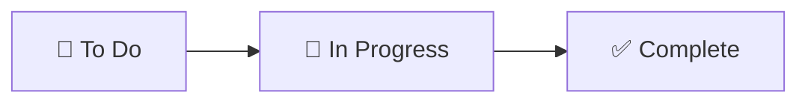
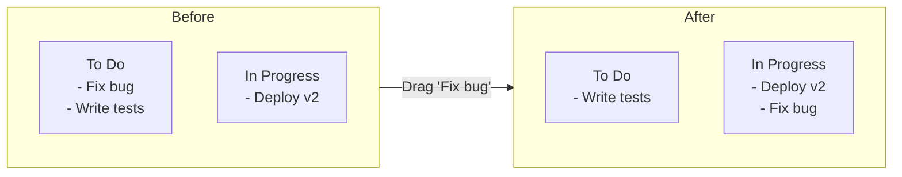
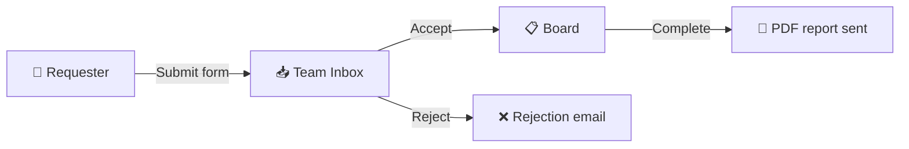

# DumpFire — Feature Overview

DumpFire is a self-hosted Kanban board for teams that want fast, visual task management without third-party subscriptions. This guide covers every feature from a user's perspective.

## What Is DumpFire?

DumpFire is a digital task board. Think of it as a wall of sticky notes on your screen — you create cards for tasks, organise them into columns, and drag them from left to right as work progresses.

Unlike Trello, Jira, or Monday.com, DumpFire runs on **your own server**. Your data never leaves your network.

---

## Core Features

### Boards

Boards are your workspaces. Each board has columns that represent stages of work.

- **Create unlimited boards** — one per project, team, or sprint
- **Emoji icons** — personalise each board with an emoji
- **Board categories** — group related boards together
- **Sub-boards** — create a board inside a card for detailed breakdowns
- **Public boards** — make a board visible to all users
- **Favourites** — star boards for quick access from the dashboard

### Cards

Cards are your tasks. Each card sits in a column and can be enriched with detail.

| Feature | Description |
|---------|-------------|
| **Title and description** | Rich text descriptions with Markdown support |
| **Priority levels** | Critical, High, Medium, Low — colour-coded badges |
| **Due dates** | Set deadlines with visual overdue warnings |
| **Labels** | Tag cards with coloured labels for filtering |
| **Categories** | Classify cards by category within a board |
| **Colour tags** | Visual colour dots for quick scanning |
| **Cover images** | Add a cover image to make cards stand out |
| **Business value** | Document why this task matters |
| **Pin to top** | Keep important cards at the top of a column |
| **On-hold notes** | Add a reason when putting a task on hold |
| **Recurrence** | Set recurring tasks that auto-regenerate |

### Subtasks

Break large tasks into smaller steps:
- Checkbox-style completion tracking
- Individual priority and due dates per subtask
- Progress bar shows completion percentage on the card
- **Completion guard** — prevents moving a card to "Complete" if subtasks remain open

### Drag and Drop

Move cards between columns by dragging them. Everything updates in real-time for all users viewing the board.

### Bulk Actions

Select multiple cards with checkboxes and apply actions in bulk:
- **Bulk move** — move selected cards to any column
- **Bulk delete** — archive selected cards
- **Bulk priority** — change priority of all selected cards

---

## Collaboration

### Teams

Create teams and add members. Share boards with entire teams at once instead of individually.

### Board Sharing

Share boards with specific permissions:

| Role | What they can do |
|------|-----------------|
| **Owner** | Everything — create, edit, delete, manage sharing |
| **Editor** | Create and edit cards, move cards between columns |
| **Viewer** | View the board only — no changes allowed |

### Assignees

Assign one or more team members to any card. Assignees receive email notifications when their cards are updated.

### Comments

Discuss tasks directly on cards:
- **@mentions** — tag team members to get their attention
- **Markdown support** — format comments with bold, code, lists
- **Email notifications** — mentioned users receive email alerts

### Real-Time Updates

All changes appear instantly for everyone viewing the same board. No need to refresh — when someone moves a card, you see it move live.

---

## Task Requests

External stakeholders can submit task requests without needing a DumpFire account.

- **Public request form** — anyone with the link can submit
- **Conversation thread** — back-and-forth messaging between requester and team
- **Progress emails** — requesters get email updates as work progresses
- **Completion report** — a PDF is automatically generated and emailed when the task is finished

---

## Reporting

### On-Demand Reports

Generate PDF reports for any board, category, or the entire system. Reports include:
- Executive summary with key metrics
- Priority breakdown
- Assignee performance stats
- Outstanding and completed task lists

### Scheduled Reports

Set up automatic weekly or monthly reports delivered to any email addresses.

### Charts

- **Burndown chart** — see task completion over time
- **Cumulative Flow Diagram** — visualise workload distribution across columns

---

## Gamification

### XP System

Completing tasks earns XP for the user who moved the card to "Complete":

| Action | XP Earned |
|--------|-----------|
| Complete a task | +100 XP |
| Complete a task with all subtasks done | Bonus XP |

### Levelling

Every 500 XP earns a new level. Progress is shown in the board header.

### Celebrations

🎆 When a card reaches "Complete", a **fireworks celebration** plays on screen for all users viewing the board.

---

## Customisation

### 16 Built-In Themes

| Theme | Style |
|-------|-------|
| Light | Clean white default |
| Dark | Premium dark mode |
| Solarized | Classic Solarized palette |
| Coffee | Warm beige light |
| Rose | Soft pink light |
| Cappuccino | Rich brown dark |
| Midnight | Deep indigo dark |
| Ocean | Blue marine dark |
| Forest | Earthy green light |
| Lavender | Soft purple light |
| Sunset | Warm orange dark |
| Nord | Cool arctic dark |
| Dracula | Iconic purple dark |
| Monokai | Warm code editor dark |
| Cherry | Rich crimson dark |
| Arctic | Icy blue-white light |
| Hacker | Green-on-black terminal |

### Sound Effects

Audio feedback for card actions:
- **Pop** — card moved between columns
- **Chime** — task completed
- **Sparkle** — new card created
- **Swoosh** — notification received

### Column Customisation

- **WIP limits** — set maximum cards per column with visual warnings
- **Colour coding** — customise column header colours
- **Add Card button** — toggle quick-add on specific columns
- **Reorderable** — drag columns to rearrange

---

## Administration

### User Management

- **Roles**: Superadmin, Admin, and User
- **Invite via email** — send password-set links to new users
- **Emoji avatars** — each user chooses their own emoji identity

### Automated Backups

- Schedule backups hourly, every 6h, 12h, daily, or weekly
- Push to **SFTP**, **Amazon S3**, **Google Drive**, or **OneDrive**
- Retention limits automatically delete old backups
- Failure alerts via email

### Archive Management

- **Soft delete** — archived cards can be restored at any time
- **Permanent delete** — remove cards forever when needed
- **Admin purge** — bulk-delete all archived cards at once

### SMTP Configuration

Configure email sending from the Admin panel. Test with a single click.

---

## API Access

DumpFire has a full REST API for automation:
- **API keys** — generate and manage from your account
- **60 endpoints** — boards, cards, subtasks, assignees, and more
- **Rate limited** — 60 requests/minute per key
- **PowerShell, Python, curl** examples included

Common integrations:
- CI/CD pipelines creating task cards
- Monitoring tools auto-creating incident cards
- Chat bots reading and updating task status
- Custom dashboards pulling board data

---

## Data Ownership

| Aspect | DumpFire | SaaS alternatives |
|--------|----------|-------------------|
| **Data location** | Your server | Their cloud |
| **Data access** | Full database access | API-limited |
| **Backup control** | You choose where | Vendor-decided |
| **Subscription** | None — self-hosted | Monthly per user |
| **Feature limits** | Unlimited everything | Often tiered |
| **Uptime** | You control it | Subject to outages |
