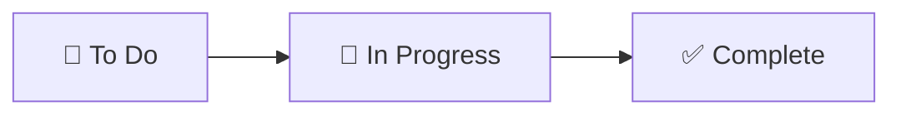
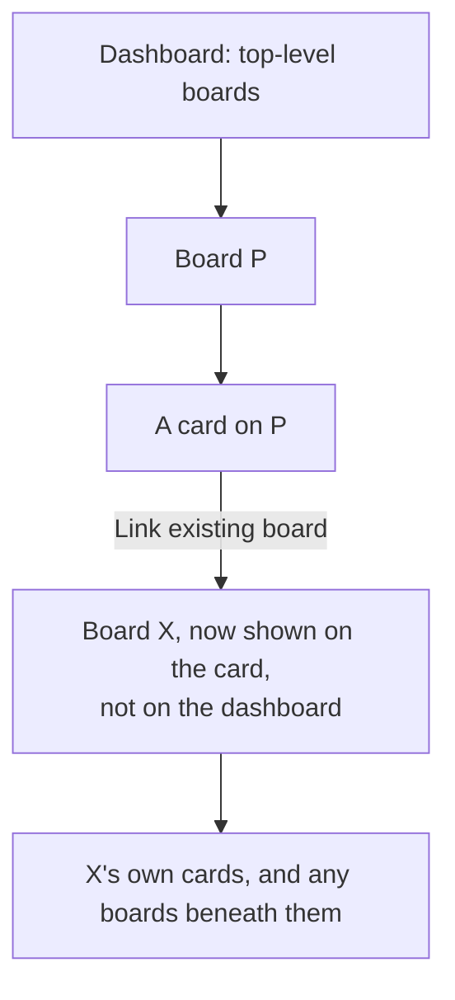
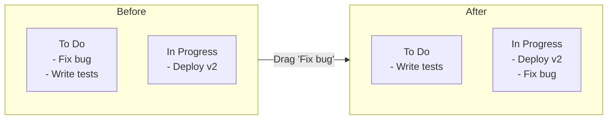
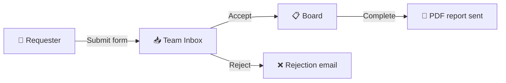

# DumpFire — Feature Overview

DumpFire is a self-hosted Kanban board for teams that want fast, visual task management without third-party subscriptions. This guide covers every feature from a user's perspective.

## What Is DumpFire?

DumpFire is a digital task board. Think of it as a wall of sticky notes on your screen — you create cards for tasks, organise them into columns, and drag them from left to right as work progresses.

```mermaid
flowchart LR
    ToDo["📝 To Do"] --> InProgress["🔨 In Progress"]
    InProgress --> Complete["✅ Complete"]
```

Unlike Trello, Jira, or Monday.com, DumpFire runs on **your own server**. Your data never leaves your network.

---

## Core Features

### Boards

Boards are your workspaces. Each board has columns that represent stages of work.

- **Create unlimited boards** — one per project, team, or sprint
- **Emoji icons** — personalise each board with an emoji
- **Board categories** — group related boards together. You see a group that holds a board you can open, or one with no board in it yet, such as one you have just made
- **Sub-boards** — create a board inside a card for detailed breakdowns
- **Public boards** — make a board visible to all users
- **Favourites** — star boards for quick access from the dashboard
- **Your dashboard figures are yours** — the assigned, active, overdue and due-soon counts, Upcoming Deadlines, the trends and Recent Activity cover only boards you can open. When you are taken off a board, its cards and your past actions on it leave them

### Cards

Cards are your tasks. Each card sits in a column and can be enriched with detail.

| Feature | Description |
|---------|-------------|
| **Title and description** | Rich text descriptions with Markdown support |
| **Priority levels** | Critical, High, Medium, Low — colour-coded badges |
| **Due dates** | Set deadlines with visual overdue warnings |
| **Labels** | Tag cards with coloured labels for filtering. Labels are made and changed in the card window, on any saved card: click a label to put it on or take it off, "+ New label" makes one with a name and a colour and puts it on the card, and "Edit labels" renames, recolours or deletes one. A delete asks first, since it takes the label off every card on the board. A new card gets its labels once it is saved |
| **Categories** | Classify cards by a category of their own board, or by a shared one that belongs to no board. The card window offers no other board's: on a board's page it offers those two kinds, and in All Tasks the card's board's own; a card already filed under another board's category keeps it until it is changed, and still shows its name. Lists of categories, Manage Categories among them, show the categories of boards you can open and the shared ones |
| **Colour tags** | Visual colour dots for quick scanning |
| **Card ID** | Every card displays a unique `#N` identifier for easy reference. A number is never given to a second card, even after the first is deleted |
| **Attachments** | Attach files of up to 25 MB to a card. PNG, JPEG, GIF and WebP images show as thumbnails on the card and open in the browser; every other attachment, PDFs included, is saved to disk |
| **Card covers** | A strip of colour across the top of the card, on the board and in the card window, to make a card stand out. Pick one of eight gradients or eight colours, or any colour of your own, under More options on a saved card |
| **Business value** | Document why this task matters |
| **Duplicate** | Right-click a card and choose Duplicate: a copy, its subtasks open, is added at the end of the same column. The copy of a finished card is new work, so it goes to the end of To Do (the board's first column that is not Complete or Done) instead, and the message says where: `Duplicated "Fix bug (Copy)" into To Do` |
| **Pin to top** | Keep important cards at the top of a column |
| **On-hold notes** | Add a reason when putting a task on hold |

### Subtasks

Break large tasks into smaller steps:
- Checkbox-style completion tracking
- Individual priority and due dates per subtask
- Progress bar shows completion percentage on the card
- **Completion guard** — prevents moving a card to "Complete" if subtasks remain open

### Sub-boards

A card can have a whole board beneath it, for work too large for a list of subtasks. Open the card and, under **Sub-board**, either create a new board there or choose **Link existing board** to put one of your boards beneath the card.

- **Linking asks first.** The confirmation says what changes: the board is shown on the card instead of on the dashboard, so its members who cannot open the board the card is on no longer see it on theirs; those who can open the board the card is on see it on the card only if they can open the linked board too, but that board's reports, scheduled ones included, take in its cards for all of them; that board's editors can move the card, taking the linked board with it; the card cannot be completed while the linked board has cards that are not complete; and the linked board is deleted for good, with everything on it, if the card, its column or the board the card is on is ever deleted for good.
- **Who may link a board.** The board's owner or an administrator. The owner is whoever created the board; someone shared as Owner before 14 October 2026 keeps that role and may link it too, but no screen can make anyone an owner now. A board with no owner, such as one whose creator was deleted, can be linked only by an administrator. Whoever links it must also be able to edit the board the card is on. An editor of a board cannot put it beneath another board's card, because that would hand its deletion to that board's editors. The list offers only the boards you may link, so an editor who owns no other board does not see the button.
- **No loops.** A board cannot go beneath a card on itself or on one of its own sub-boards; DumpFire refuses it and says why.
- **A card cannot be moved onto its own sub-board**, or onto a board beneath one: its sub-boards go with it, so they would hang beneath themselves, on no dashboard, and the card could never be completed. DumpFire refuses the move and says why, in All Tasks' Move window and through the API, and the card stays where it was. A board left beneath one of its own cards by a move made before this was refused still opens, its path showing the loop once round, and the server names it in the system log at every start until it is put right: see [Admin Operations Guide](admin-guide.md#a-board-beneath-one-of-its-own-cards).
- **You see only the sub-boards you can open.** A sub-board is a board of its own: being able to open the board above it does not open it. One you were not given is not shown on its card, in the card's window or on the dashboard, and is not counted in your dashboard figures. Completing its card is still refused while the sub-board has open cards.
- **The path at the top of a sub-board** names each board above it. One you cannot open is shown as "🔒 A board you cannot open", with no link; Delete Sub-board is still offered.
- **A refusal is said in DumpFire's words**, and "Board linked as sub-board" appears only once it is saved. Until 14 October 2026 the button said the board was linked and nothing was saved.

```mermaid
flowchart TD
    Dashboard["Dashboard: top-level boards"] --> P["Board P"]
    P --> Card["A card on P"]
    Card -->|"Link existing board"| X["Board X, now shown on the card,<br/>not on the dashboard"]
    X --> Sub["X's own cards, and any boards beneath them"]
```

### Dependencies

A card's window lists what the card is **Blocked by** and what it **Blocks**. Either end can be a card or a subtask, on this board or another.

- **A subtask reads as one.** A row for a subtask reads "subtask #45 of #12", and its link opens card 12, the card the subtask belongs to. Removing it removes that link and no other.
- **Every change is recorded.** Adding or removing one dependency, in the card window or through the API, shows in the board's activity panel and on the Audit page; the panel names one made in the card window "Dependency added" or "Dependency removed". The bulk endpoint writes one `api:dependencies_bulk_added` entry for the whole batch, on the first board it touched only, and the links that go when a card is deleted write none of their own.
- **Not counted as work.** The activity report does not take a dependency added or removed to be work on the card, or the work of whoever added or removed it.
- **Work on a board you cannot open is not named.** A card that waits on a card of a board you were not given still shows as blocked, and the other end is listed as "A card on a board you cannot open", with no link and no board or column: on the Blocked chip, in the card window, on All Tasks and on the plan. You can still remove the link.

### Drag and Drop

Move cards between columns by dragging them. Everything updates in real-time for all users viewing the board.

```mermaid
flowchart LR
    subgraph Before
        Col1A["To Do\n- Fix bug\n- Write tests"]
        Col2A["In Progress\n- Deploy v2"]
    end
    subgraph After
        Col1B["To Do\n- Write tests"]
        Col2B["In Progress\n- Deploy v2\n- Fix bug"]
    end
    Before -->|"Drag 'Fix bug'"| After
```

### Bulk Actions

Select multiple cards with checkboxes and apply actions in bulk:
- **Bulk move** — move selected cards to any column
- **Bulk archive** — archive selected cards. They can be restored from Archived Cards
- **Bulk priority** — change priority of all selected cards

### Search & Filtering

Filter cards in real time using the search bar:
- **Text search** — matches card titles, descriptions, categories, and assignee names
- **Card ID search** — type `#221` to jump to card 221 instantly
- **Assignee filter** — filter cards by assigned team member

---

## Collaboration

### Teams

Create teams and add members. Share boards with entire teams at once instead of individually.

### Board Sharing

Share boards with specific permissions:

| Role | What they can do |
|------|-----------------|
| **Owner** | Everything — create, edit, delete, manage sharing. The board's creator is its owner. No share makes anyone else one: the share window offers Owner only on a row already stored as owner, which keeps it |
| **Editor** | Create and edit cards, move cards between columns |
| **Viewer** | View the board only — no changes allowed |

The share window lists every user and every team by name, so a board can be shared with anyone. Email addresses are shown only where you may see them: an administrator sees everyone's, and the board's owner sees those of the people the board is already shared with.

### Assignees

Assign one or more team members to any card. Assignees receive email notifications when their cards are updated.

### Comments

Discuss tasks directly on cards:
- **@mentions** — tag team members to get their attention
- **Markdown support** — format comments with bold, code, lists
- **Email notifications** — mentioned users receive email alerts

### Real-Time Updates

All changes appear instantly for everyone viewing the same board. No need to refresh — when someone moves a card, you see it move live.

---

## Task Requests

External stakeholders can submit task requests without needing a DumpFire account.

```mermaid
flowchart LR
    Requester["📨 Requester"] -->|"Submit form"| Inbox["📥 Team Inbox"]
    Inbox -->|"Accept"| Board["📋 Board"]
    Inbox -->|"Reject"| Notify["❌ Rejection email"]
    Board -->|"Complete"| Report["📄 PDF report sent"]
```

- **Public request form** — anyone with the link can submit. A request from someone without an account is passed to the team once they confirm it from an email sent to the address they gave
- **Choosing a board is optional** — someone without an account sends a request to a person or a team and is not shown any board; whoever accepts the request chooses the board and column. A signed-in requester may pick one of the boards they can open, or leave it to the team
- **Private conversation link** — each request has its own secret link, emailed to the requester; it is the only way in without an account
- **Conversation thread** — back-and-forth messaging between requester and team
- **Progress emails** — requesters get email updates as work progresses
- **Completion report** — a PDF is automatically generated and emailed when the task is finished

---

## Reporting

### On-Demand Reports

Generate PDF reports for any board, category, or the entire system. Reports include:
- Executive summary with key metrics — cards and tasks (cards + subtasks) shown side by side, the same figures as the dashboard's All Tasks row
- Priority breakdown
- Assignee performance stats
- Completed work first, then the outstanding task lists

Use the **Include** filter to choose what the report lists:
- **All work** — completed in the period first, then everything still open
- **Completed only** — just what was finished in the period
- **In Progress only** — open cards that have left To Do (including On Hold and Review)
- **To Do only** — cards not yet started

### Scheduled Reports

Set up automatic weekly or monthly reports delivered to any email addresses. Each schedule remembers its own detail level and Include filter. A schedule is sent at a time of day written `HH:MM` (09:00 when it is left empty), on a day of the week or a day of the month from 1 to 28, and each recipient must be an email address: one that is not is refused when the schedule is saved, and when a report is emailed by hand, rather than left out. The recipients may be put one to a line, or separated by commas or `;`, as in the report's email dialog; a schedule saves them separated by commas. A report's period must not end before it begins.

### Charts

- **Burndown & burn-up charts** — for any board, several boards, a board group, a milestone or everything, narrowed by category, label, assignee or priority; with work in play, an ideal line to the target date, a forecast and a time-to-deliver estimate (likely and 85% dates, and the chance of hitting a target). Every figure explains itself on hover. Full page at `/burndown`, a compact chart in board Statistics, and a panel on every milestone plan. See [Burndown Charts](burndown-charts.md)
- **Cumulative Flow Diagram** — visualise workload distribution across columns

### Graph View

An interactive, Neo4j-style knowledge graph showing how boards, cards, columns, and users connect across the entire workspace.

- **Force-directed layout** — nodes arrange themselves naturally based on relationships
- **Lazy-load expansion** — click any board node to reveal its cards and columns
- **Pan, zoom, and drag** — navigate the graph like a map
- **Colour-coded nodes** — boards (purple), cards (cyan), columns (amber), users (green)
- **Hover tooltips** — see entity details without clicking

---

## Gamification

### XP System

Completing a card earns XP for the user who moved it into a Complete (or Done)
column, or who created it in one. The amount depends on the card's priority:

| Card priority | XP Earned |
|---------------|-----------|
| Low | +50 XP |
| Medium | +100 XP |
| High | +150 XP |
| Critical | +200 XP |

XP is awarded **once per card**, the first time it is ever completed, and the same
way however the card was moved — dragged on the board, moved from the All Tasks
page or the card modal, or moved through the API. Moving a card back out of
Complete and in again earns nothing. A card added straight to a Complete column (with the
column's **+**, through the API, or by accepting a task request into it) is completed as it
is created, and its creator earns the XP then.

### Levelling

Every 500 XP earns a new level. Progress is shown in the board header.

### Celebrations

🎆 When a card is moved into, or created in, a Complete (or Done) column, a **fireworks celebration** plays on screen for all users viewing the board.

---

## Customisation

### 16 Built-In Themes

| Theme | Style |
|-------|-------|
| Light | Clean white default |
| Dark | Premium dark mode |
| Solarized | Classic Solarized palette |
| Coffee | Warm beige light |
| Rose | Soft pink light |
| Cappuccino | Rich brown dark |
| Midnight | Deep indigo dark |
| Ocean | Blue marine dark |
| Forest | Earthy green light |
| Lavender | Soft purple light |
| Sunset | Warm orange dark |
| Nord | Cool arctic dark |
| Dracula | Iconic purple dark |
| Monokai | Warm code editor dark |
| Cherry | Rich crimson dark |
| Arctic | Icy blue-white light |
| Hacker | Green-on-black terminal |

### Sound Effects

Audio feedback for card actions:
- **Pop** — card moved between columns
- **Chime** — task completed
- **Sparkle** — new card created
- **Swoosh** — notification received

### Column Customisation

- **WIP limits** — set maximum cards per column with visual warnings
- **Colour coding** — customise column header colours
- **Add Card button** — toggle quick-add on specific columns; the choice is saved with the column
- **Reorderable** — drag columns to rearrange
- **Renaming keeps what the cards mean** — a column called Complete or Done is where finished work lives. While it holds any card, archived ones included, it can be renamed only to Complete or Done, and a column that holds cards cannot be renamed Complete or Done: the cards would turn back into open work, or be finished without anyone finishing them. The board says why and keeps the old name. An empty column can be renamed to anything

---

## Administration

### User Management

- **Roles**: Superadmin, Admin, and User
- **Invite via email** — send password-set links to new users
- **Emoji avatars** — each user chooses their own emoji identity

### Automated Backups

- Schedule backups hourly, every 6h, 12h, daily, or weekly
- Push to **SFTP**, **Amazon S3**, **Google Drive**, or **OneDrive**
- Retention limits automatically delete old backups
- Failure alerts via email
- A backup holds the database. Attachment files are kept in a folder on the server, which your administrator backs up separately

### Archive Management

- **Soft delete** — archived cards can be restored at any time, and come back exactly as they were: subtasks, comments, attachments, dependencies and sub-boards included
- **Permanent delete** — remove cards forever when needed. The card's subtasks, comments, dependencies and sub-boards go with it, and the confirmation says so before anything is deleted
- **Deleting a column deletes its cards** — for good, not to the archive. Move the cards first if you want to keep them
- **A 30-day safety net for files** — the attachment files of deleted cards are kept for 30 days, so restoring a backup within that time brings the attachments back too
- **Admin purge** — bulk-delete all archived cards at once
- **All or nothing** — a delete either happens completely or not at all. If something goes wrong part of the way through, nothing is deleted and the page says so

### SMTP Configuration

Configure email sending from the Admin panel. Test with a single click.

---

## API Access

DumpFire has a full REST API for automation:
- **API keys** — generate and manage from your account
- **80 operations** — boards, cards, subtasks, assignees, and more
- **Rate limited** — 60 requests/minute per key
- **Every field checked** — a field the API cannot use is refused with a `400` that names it, before anything is written: a priority it does not know, a date not written `YYYY-MM-DD`, text where a number belongs
- **A key sees what its user sees** — lists, dependencies and plans leave out, or show as "on a board you cannot open", what is on boards the key's user cannot open; a webhook's address and secret are given only to the board's owner and administrators
- **PowerShell, Python, curl** examples included

Common integrations:
- CI/CD pipelines creating task cards
- Monitoring tools auto-creating incident cards
- Chat bots reading and updating task status
- Custom dashboards pulling board data

---

## Data Ownership

| Aspect | DumpFire | SaaS alternatives |
|--------|----------|-------------------|
| **Data location** | Your server | Their cloud |
| **Data access** | Full database access | API-limited |
| **Backup control** | You choose where | Vendor-decided |
| **Subscription** | None — self-hosted | Monthly per user |
| **Feature limits** | Unlimited everything | Often tiered |
| **Uptime** | You control it | Subject to outages |
