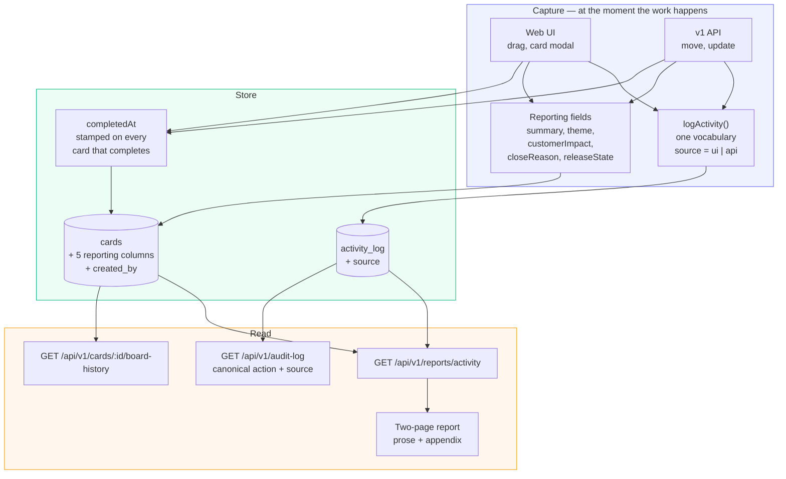
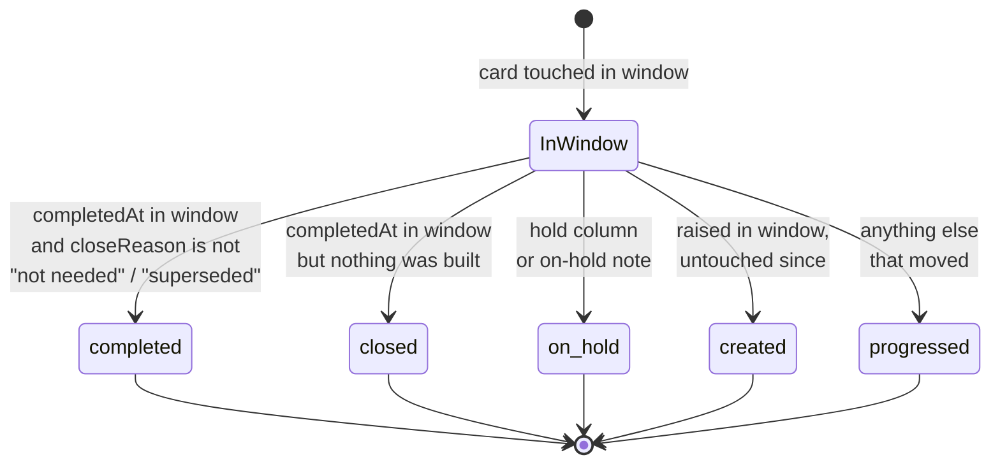
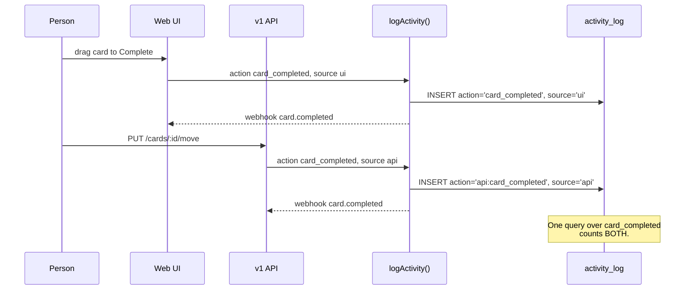

# Management Activity Reporting

## Why this exists

Senior management need a regular, readable account of what the development team
delivered and why it mattered. Producing the first one by hand cost **229 API
calls and about 18 minutes of extraction**, and most of that was writing 196
plain-English summaries, because card titles are written for engineers.

Time was the smaller problem. The report was also **wrong in two directions and
had no way to show it**:

1. **It under-counted activity.** The audit log recorded only `api:*` actions, so
   everything done in the web UI was invisible. 42 of 145 completions in the
   window had no event at all and were found only by reading each card's
   `completedAt`. Anything trusting the log under-reported delivered work by
   roughly 30%.
2. **It over-counted delivery.** Cards closed as *not needed* or *superseded*
   land in the same Complete column as delivered work and are indistinguishable
   once there. "145 completed" counted eight cards where nothing was built.

Both are now fixed at the source rather than corrected in the write-up.

## How the pieces fit



The shape of the fix is that **every fact the report needs is recorded when it is
cheap to record** — while the person who knows it is looking at the card — rather
than reconstructed a month later by someone guessing.

## Completion is counted from `completedAt`

This is the single most important decision in the design, and it is deliberate.

The audit log is now complete, but a report that *depended* on that would
silently under-report for every window predating the fix. The card's own
`completedAt` is the fact; the log is corroboration.

Three rules follow:

- **Bucketing never reads audit events.** Only `completedAt`, `createdAt`,
  `updatedAt` and the card's column.
- **Sitting in a Complete column is not a completion.** A card finished in May
  that picks up one comment in September is `progressed`, not a September
  delivery. Counting it would overstate the period — exactly what this replaces.
  `meta.completedOutsideWindow` reports how many such cards were seen.
- **Every completion path stamps the date.** Drag-and-drop, the card modal and
  `PUT /cards/:id/move` all set it. Previously the drag path stamped only *one*
  card per request, so dragging two cards to Complete together left one of them
  complete with no completion date and invisible to every report.

### Buckets



A card is "touched in the window" if **any** of these hold: it completed, it was
raised, it was edited, an audit event names it, or someone commented on it. The
union matters — relying on the audit log alone is what made the hand-built report
miss 30% of completions.

## The five reporting fields

Stored on `cards`, all nullable, none backfilled.

| Column | Values | Purpose |
|---|---|---|
| `summary` | free text, ≤ 200 chars | Plain English, ~12 words. Quoted **verbatim** into the appendix. |
| `theme` | `new capability`, `customer issue`, `security & compliance`, `maintenance` | Groups the prose sections. |
| `customer_impact` | `none`, `internal`, `live customers` (optionally `: Quickline`) | Who felt it. |
| `close_reason` | `delivered`, `not needed`, `superseded`, `parked` | Why it left the board. |
| `release_state` | `built`, `on UAT`, `live` | How far it travelled toward customers. |

Validation lives in `src/lib/server/reporting-fields.ts`; the vocabularies are
shared with the card modal through `src/lib/reporting.ts`, so the list a person
picks from and the list the API accepts cannot drift apart.

**An unrecognised value is a 400, never a silent drop.** A dropped value reads
back as *not recorded* and is indistinguishable from one that was never set.

**Nothing is inferred to fill a gap.** A card with no summary reports a null
summary and its technical title, not a generated paraphrase. This text goes to
senior management under someone's name, and a plausible invention is worse than
an obvious blank.

### Where they are captured

Two places, both optional:

- **Card modal** — a collapsed *Reporting* section, expanded automatically once
  anything has been recorded.
- **Completion prompt** — after a card is dragged to Complete, a small dialog
  asks for `summary` and `closeReason`. It appears *after* the move, so skipping
  costs nothing. A required field here would be filled in with whatever closes
  the dialog fastest.

## The audit log

One vocabulary, two sources.



On disk the API keeps its historic `api:` prefix, so 2,500 existing rows and
every stored consumer keep working. On read, `action` is canonical, `rawAction`
is the stored spelling, and `source` resolves from the column or falls back to
the prefix. **Nothing is backfilled** — a guessed `source` would be
indistinguishable from a recorded one.

Webhooks now fire off the canonical name, so a card completed in the UI notifies
subscribers. Previously only the `api:` spellings were mapped and it notified
nobody.

### Paging

Responses carry `total` and `hasMore` alongside `limit`/`offset`/`count`. The
default page of 100 was undocumented and a full page looked exactly like a
complete result — which is how a 2,500-entry scan quietly became a 100-entry one.

## Board attribution

A card that changes board mid-window appears in the log under two different
`boardId`s — 13 cards did in one 30-day window. The events always recorded the
board correctly at the time; what was missing was any way to read the sequence
back. `GET /api/v1/cards/:cardId/board-history` returns the spans, oldest first.

## A note on timestamps

Two formats coexist in this database and are compared as strings:

| Written by | Shape | Columns |
|---|---|---|
| SQLite `datetime('now')` | `2026-04-09 13:53:46` | `cards.created_at`, `activity_log.created_at`, `card_comments.created_at` |
| JavaScript `toISOString()` | `2026-04-09T13:54:01.210Z` | `cards.completed_at`, `cards.updated_at` |

They do not sort against each other: a space (`0x20`) sorts before `T` (`0x54`),
so `'2026-09-14 09:00:00' < '2026-09-14T00:00:00.000Z'` is **true**. A single
report query touches both, so every timestamp is trimmed to
`YYYY-MM-DD HH:MM:SS` on both sides before any comparison. Sub-second precision
is dropped, which is immaterial for a report bucketed by day.

Getting this wrong silently includes or excludes a whole day's work at a window
boundary.

## Using it

```powershell
# One call. Do NOT pass -Compact — it would discard the whole report.
& $API -Action report -UserId 3 -From 2026-08-15 -To 2026-09-14
```

Then **read `meta` before quoting a figure**:

| Field | Why |
|---|---|
| `closeReasonAssumedCount` | Completions counted as delivered with no recorded reason. |
| `completedOutsideWindow` | Cards in Complete that did not complete in this period. |
| `missingSummaryCount` | Appendix lines falling back to technical titles. |
| `attribution` | Current assignment stands in for historic assignment, which is not recorded. |
| `boardsExcludedForAccess` | Boards omitted because the caller cannot see them. |

## Files

| Path | Role |
|---|---|
| `src/lib/server/activity-report.ts` | Report builder, bucketing, board history |
| `src/lib/server/reporting-fields.ts` | Validation of the five fields |
| `src/lib/reporting.ts` | Vocabularies shared with the client |
| `src/lib/server/logActivity.ts` | Single writer, canonical vocabulary, source marker |
| `src/routes/api/v1/reports/activity/+server.ts` | Report endpoint |
| `src/routes/api/v1/audit-log/+server.ts` | Audit query, canonical action, paging |
| `src/routes/api/v1/cards/[cardId]/board-history/+server.ts` | Board spans |
| `src/lib/components/board/CompletionPromptModal.svelte` | Post-completion prompt |
| `drizzle/0048_add_audit_completeness.sql` | `activity_log.source`, `cards.created_by` |
| `drizzle/0049_add_card_reporting_fields.sql` | The five reporting columns |

## Known limits

- **Milestone membership is current membership.** A card's milestone history is
  not recorded, so a card moved into a goal mid-window counts for the whole of
  it. Reported, not hidden.
- **Attribution uses current assignment.** Historic assignment is not recorded.
  `meta.attribution` states this in words in every response.
- **Milestones without a target date** can show progress but never "on track" or
  "at risk". `hasTargetDate` says which are which.
