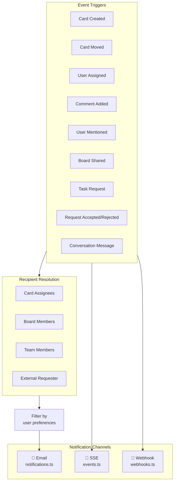
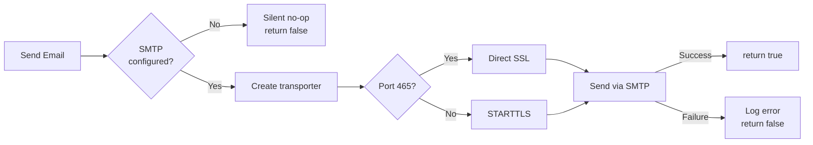
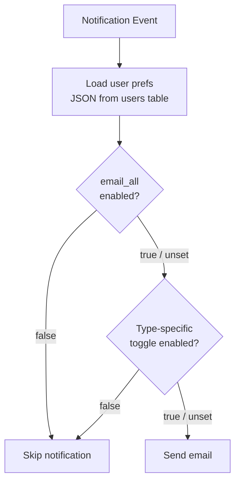
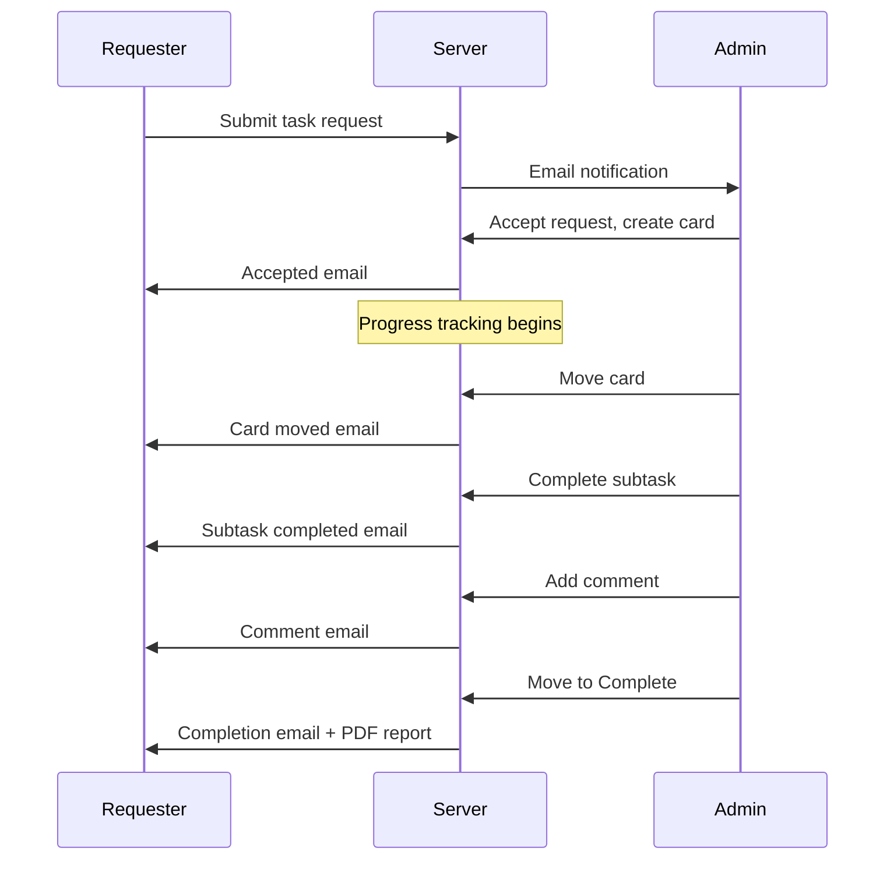
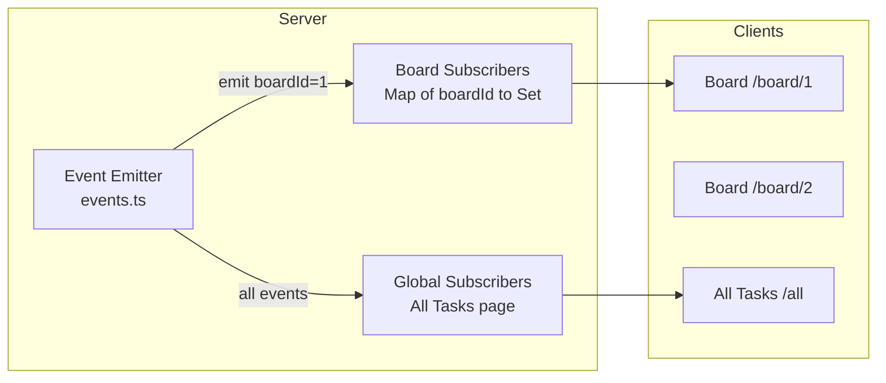
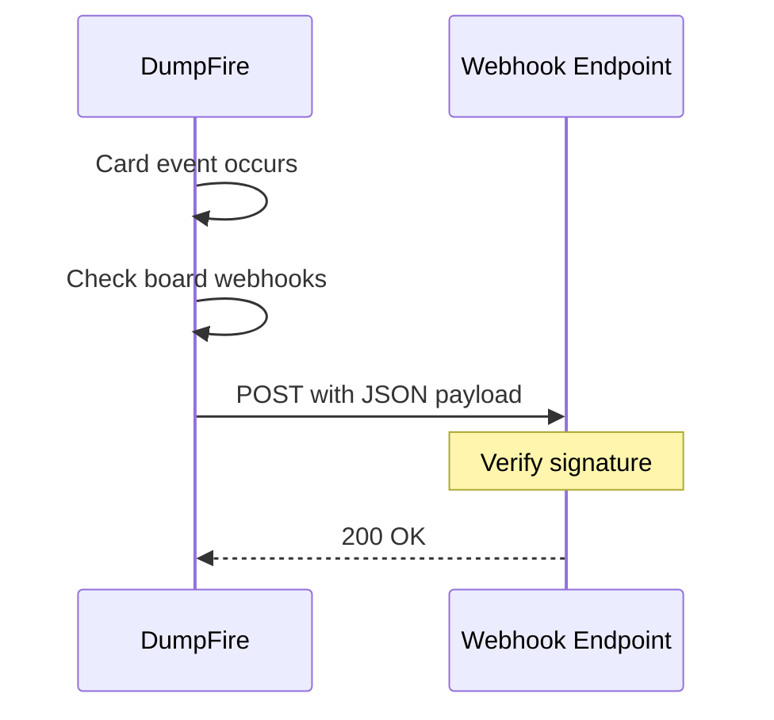

# Notifications & Email System

DumpFire notifies users through three channels: email notifications via SMTP, real-time browser updates via SSE, and external webhooks. All channels are fire-and-forget — they never block API responses.

## Notification Architecture

## Email Notifications

### SMTP Configuration

SMTP settings are stored in the `settings` table and configured via the Admin panel.

| Setting Key | Type | Default | Description |
|------------|------|---------|-------------|
| `smtp_host` | string | — | SMTP server hostname |
| `smtp_port` | number | 587 | Port number |
| `smtp_secure` | boolean | false | Use direct SSL |
| `smtp_user` | string | — | Auth username |
| `smtp_pass` | string | — | Auth password |
| `smtp_from_address` | string | — | Sender email address |
| `smtp_from_name` | string | DumpFire | Sender display name |

### Connection Handling

Key transport settings:
- **IPv4 forced** — Prevents ETIMEDOUT on dual-stack DNS
- **EHLO name** — Set to `dumpfire.app` to avoid Google 421 errors from local hostnames
- **Timeouts** — 10s connection, 10s greeting, 15s socket

### Email Types

| Event | Recipients | Preference Key | Subject Format |
|-------|-----------|---------------|----------------|
| Card Created | Assignees | `email_assigned` | `New card: {title}` |
| Card Moved | Assignees | `email_moved` | `Card moved: {title} → {column}` |
| User Assigned | Assignee | `email_assigned` | `Assigned: {title}` |
| Comment Added | Board members | `email_comments` | `New comment on: {title}` |
| User Mentioned | Mentioned user | `email_mentions` | `{author} mentioned you: {title}` |
| Board Shared | Target user | `email_board_shared` | `Board shared: {boardName}` |
| Task Request | Target user/team | `email_requests` | `New request: {title}` |
| Request Accepted | Requester | — | `Request accepted: {title}` |
| Request Rejected | Requester | — | `Request declined: {title}` |
| Conversation Message | Requester/Admin | `email_requests` | `Message on request: {title}` |
| Request Complete | Requester | `email_request_progress` | `Your request is complete: {title}` |

### User Notification Preferences

Stored as JSON in `users.notification_prefs`. Each user can toggle individual notification types.

### Requester Progress Notifications

When a task request is accepted and converted to a card, the requester receives progress emails:

On card completion, a **PDF task report** is automatically generated and attached to the completion email.

## Real-Time Updates via SSE

### Architecture

### Event Types

| Event | Payload | Trigger |
|-------|---------|---------|
| `update` | `{type: 'card'}` | Card created, updated, moved, deleted |
| `update` | `{type: 'column'}` | Column added, reordered, deleted |
| `celebrate` | `{cardTitle, xpGained}` | Card moved to completion column |

### Connection Lifecycle

1. Client opens `GET /api/events?boardId={id}` or `GET /api/events?global=true`
2. Server creates SSE stream with `text/event-stream` content type
3. Server calls `subscribe(boardId, listener)` or `subscribeGlobal(listener)`
4. On board mutation, server calls `emit(boardId, event, data)`
5. All subscribed listeners receive the event
6. On client disconnect, unsubscribe callback cleans up the listener set

## Webhooks

Board-level webhooks fire HTTP POST requests to configured URLs when events occur.

### Configuration

| Field | Type | Description |
|-------|------|-------------|
| `url` | string | Target HTTP endpoint |
| `secret` | string | Shared secret for signature verification |
| `events` | JSON array | Event types to subscribe to |
| `active` | boolean | Enable/disable toggle |

### Webhook Flow

## Key Implementation Files

| File | Purpose |
|------|---------|
| `src/lib/server/email.ts` | SMTP config, transporter creation, sendEmail |
| `src/lib/server/notifications.ts` | All email notification functions with preference filtering |
| `src/lib/server/events.ts` | SSE event emitter with board and global subscriptions |
| `src/lib/server/webhooks.ts` | Webhook dispatch on board events |
| `src/lib/server/mentions.ts` | Extract @mentions from comment text |
